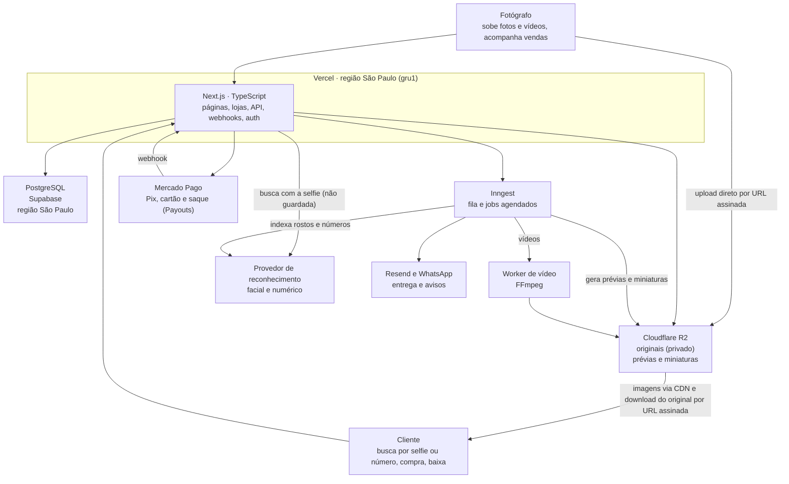

# Arquitetura — Plataforma de Venda de Fotos

Oct 6, 2026 · @gabriel

## Visão geral

Um marketplace onde fotógrafos sobem fotos e vídeos de eventos e clientes encontram e compram os seus, pela selfie, pelo número de peito ou navegando na galeria. O cliente paga na conta da plataforma; o fotógrafo saca pelo painel, e a comissão da plataforma sai no saque.

A referência de produto é a Fotto, resumida em [referencias/fotto.md](referencias/fotto.md). Ela orienta as decisões, mas não as fecha sozinha.

**Premissas adotadas:**

- Foco em fotos e vídeos de eventos (corridas, festas, formaturas, esportes), vendidos por item ou em pacote.
- Mercado brasileiro: preços em reais, pagamento por Pix e cartão, dados hospedados no Brasil.
- Fotos só em JPEG (até 30 MB); vídeos em MP4 ou MOV (até 500 MB e 5 minutos). RAW não é aceito: o fotógrafo exporta o JPEG final antes de enviar.

**Escopo do MVP:**

- Cadastro e login de fotógrafos e clientes; compra sem cadastro
- Fotógrafo cria um evento e sobe fotos e vídeos em lote
- Prévia com marca d'água e miniatura geradas automaticamente, para foto e vídeo
- Busca por reconhecimento facial (selfie) e numérico (número de peito), filtro por horário e lista de fotos não identificadas
- Galeria pública por evento, com pastas, ordenação, visibilidade (pública, não listada ou com senha) e liberação automática, manual ou agendada
- Carrinho com itens de vários eventos, checkout com Pix/cartão e download do original após o pagamento
- Descontos: cupons, desconto progressivo e pacote "todas as minhas fotos"
- Entrega automática por e-mail e por WhatsApp; recuperação de carrinho abandonado
- Fotógrafos colaboradores no mesmo evento, com divisão da venda
- Loja própria do fotógrafo, com nome, logo, cores e domínio
- Denúncia de evento ou foto, com moderação pela equipe
- Painel do fotógrafo com vendas, saldo e saque por Pix (normal em 30 dias ou antecipado em 1 dia)

**Fora do MVP:** app mobile, plugin do Lightroom, upload em tempo real, desfoque contra print, marca d'água personalizada, planos pagos para fotógrafos e os demais itens listados em [referencias/fotto.md](referencias/fotto.md#o-que-adotamos-no-mvp).

## Stack técnica

TypeScript de ponta a ponta, com Next.js no front e no back, PostgreSQL para os dados e Cloudflare R2 para os arquivos.

| Camada | Escolha | Por quê |
|---|---|---|
| Linguagem | TypeScript | Uma linguagem só no front e no back |
| Framework web | Next.js (App Router) | Páginas com SEO, API e webhooks no mesmo projeto |
| Banco de dados | PostgreSQL | Dados relacionais e transações seguras para pedidos e pagamentos |
| Acesso ao banco | Drizzle ORM | Leve, tipado e próximo do SQL |
| Arquivos | Cloudflare R2 | Compatível com S3 e sem custo de transferência de saída |
| Processamento de imagem | Sharp | Gera miniaturas e prévias com marca d'água |
| Processamento de vídeo | FFmpeg num worker separado | Prévia com marca d'água, capa e quadros para o reconhecimento; não cabe nas funções da Vercel |
| Reconhecimento facial e numérico | Amazon Rekognition (facial); provedor de OCR a decidir (números) | Indexa rostos das fotos numa coleção por evento e compara com a selfie, sem guardá-la |
| Fila de tarefas | Inngest | Processa uploads e roda os jobs agendados sem manter servidor de fila |
| Autenticação | Login com Google (OAuth 2.0 com PKCE) e e-mail e senha, sessão própria; Better Auth avaliado na Fase 11 | Usuários e sessões no nosso banco; papéis cliente, fotógrafo e gestor |
| Pagamento | Mercado Pago (Checkout Transparente via Orders + Payouts) | Pix e cartão dentro do site; saque do fotógrafo por Pix pela API |
| Interface | Tailwind CSS + shadcn/ui | Componentes prontos e fáceis de customizar |
| E-mail | Resend | Confirmação de compra, links de download e carrinho abandonado |
| WhatsApp | API oficial do WhatsApp (Cloud API ou parceiro) | Entrega automática do link de download |

## Componentes e deploy

O Next.js na Vercel é o centro: ele fala com o banco, a fila, o storage, o gateway e o provedor de reconhecimento. Os arquivos pesados nunca passam por ele.



O fotógrafo envia os arquivos direto ao R2; o cliente recebe prévias pela CDN e o original por um link temporário depois de pagar.

## Armazenamento das fotos e vídeos

Cada foto vira três arquivos no R2 e cada vídeo vira três ou quatro, separados em dois buckets: um privado para os originais e um público para o que aparece no site. O banco guarda só as chaves desses arquivos.

| Versão | Bucket | Tamanho aproximado | Uso |
|---|---|---|---|
| Original (foto) | `fotos-originais` (privado) | JPEG de 2 a 30 MB | Entregue só ao comprador, por URL assinada |
| Original (vídeo) | `fotos-originais` (privado) | MP4 ou MOV de até 500 MB | Entregue só ao comprador, por URL assinada |
| Prévia com marca d'água | `fotos-publicas` | Foto: 200 a 300 KB, 1600 px. Vídeo: 720p | Página do item e galeria ampliada |
| Miniatura | `fotos-publicas` | 30 a 50 KB, 400 px (no vídeo, um quadro de capa) | Grade da galeria |

**Padrão de nomes das chaves:**

```
envios/{fotografo_id}/{evento_id}/{foto_id}.jpg  # original chegando do navegador (privado, temporário)
originais/{fotografo_id}/{evento_id}/{foto_id}.{jpg|mp4|mov}
previas/{fotografo_id}/{evento_id}/{foto_id}.{webp|mp4}
miniaturas/{fotografo_id}/{evento_id}/{foto_id}.webp
denuncias/{denuncia_id}/{arquivo_id}          # anexos, no bucket privado
```

- `fotos.chave_original` guarda a chave no bucket privado (`envios/...` enquanto a foto está em `processando`, `originais/...` depois). `fotos.url_previa` e `fotos.url_miniatura` guardam as chaves no bucket público, e o endereço é montado na leitura com `R2_URL_PUBLICA` (`src/lib/url-publica.ts`): trocar o `r2.dev` por um domínio próprio não mexe no banco. Os dados de exemplo guardam caminhos `/exemplo/...`, que passam como estão.
- O prefixo `envios/` tem regra de ciclo de vida no R2 que apaga o que ficar lá mais de 1 dia (envio abandonado ou recusado); o original só vai para `originais/` depois de conferido.
- O acesso ao R2 fica em `src/lib/r2.ts` (API compatível com o S3, só no servidor). Sem as variáveis `R2_*`, o build e o site funcionam; o envio de fotos responde "Armazenamento de fotos não configurado" na produção e usa o envio simulado (imagens de exemplo) fora dela.

- Usar o `foto_id` (UUID) como nome evita colisão e não expõe o nome original do arquivo.
- O bucket público fica atrás de um domínio próprio na Cloudflare (ex.: `img.seusite.com.br`), com cache de CDN e sem listagem. As prévias de eventos com senha ou visíveis só após o reconhecimento também ficam nele: a proteção é o UUID impossível de adivinhar, não o bucket.
- O original nunca tem URL pública: o download usa uma URL assinada válida por cerca de 15 minutos, gerada só para quem comprou.
- Regra de retenção a decidir (a Fotto guarda por tempo indeterminado). Originais de itens vendidos seguem a regra de acesso do comprador (ver "Acesso às compras").

**Vídeos:**

- O processamento roda num worker com FFmpeg (container em Fly.io ou Railway), chamado pelo job do Inngest, porque as funções da Vercel não têm FFmpeg nem tempo para vídeos de 500 MB.
- O worker gera a prévia em 720p com marca d'água, a miniatura (um quadro do vídeo) e quadros a cada segundo para o reconhecimento facial e numérico. Os quadros são temporários e apagados depois da indexação.
- Vídeos não entram no desconto progressivo nem no pacote; cupons valem para eles.

## Modelo de dados

Valores em dinheiro ficam em centavos (inteiro) para evitar erro de arredondamento, e todos os IDs são UUID. A tabela `fotos` guarda fotos e vídeos, separados pela coluna `tipo`.

**Núcleo**

| Tabela | Campos principais | Relaciona com |
|---|---|---|
| `usuarios` | id, nome, email, telefone (opcional), papel (cliente, fotografo, admin), senha_hash (opcional: quem só usa Google não tem), google_id (opcional, único), email_confirmado_em, criado_em | — |
| `fotografos` | id, usuario_id, nome_publico, slug, bio, foto_perfil, capa, redes_sociais, cpf_cnpj, chave_pix (o próprio CPF/CNPJ, confirmado), comissao_pct | usuarios (1:1) |
| `categorias` | id, nome, slug | — |
| `eventos` | id, fotografo_id (dono), categoria_id, titulo, slug, inicio_em, fim_em, local, cidade, estado, capa, preco_foto_centavos, preco_video_centavos, status (rascunho, publicado, revisao, arquivado), visibilidade (publico, nao_listado, senha), senha_hash, listado, fotos_so_apos_busca, liberacao (automatica, manual, agendada), liberado_em, filtro_horario, listar_nao_identificadas, ordenacao | fotografos, categorias |
| `pastas` | id, evento_id, nome, ordem | eventos (N:1) |
| `fotos` | id, evento_id, pasta_id (opcional), enviada_por (fotografo_id), tipo (foto, video), chave_original, chave_previa, chave_miniatura, nome_arquivo, largura, altura, duracao_s (vídeo), tamanho_bytes, hash_conteudo, capturada_em, preco_centavos (opcional, sobrepõe o do evento), ordem, status (processando, pronta, erro), criado_em, excluida_em (opcional) | eventos, pastas, fotografos |
| `colaboradores` | id, evento_id, fotografo_id, comissao_dono_pct, nota | eventos, fotografos |

**Busca**

| Tabela | Campos principais | Relaciona com |
|---|---|---|
| `rostos` | id, foto_id, rosto_id_provedor | fotos (N:1) |
| `numeros` | id, foto_id, numero | fotos (N:1) |

A selfie do cliente não tem tabela: ela não é gravada em lugar nenhum.

**Vendas**

| Tabela | Campos principais | Relaciona com |
|---|---|---|
| `pedidos` | id, cliente_id (opcional), email_comprador, nome_comprador, whatsapp (opcional), aceita_whatsapp, token_acesso_hash, acesso_expira_em, cupom_id (opcional), subtotal_centavos, desconto_centavos, total_centavos, metodo (pix, cartao), status (pendente, pago, expirado, cancelado, estornado), expira_em, gateway_id, pix_copia_e_cola, pix_qr_code_base64, pago_em, lembrete_enviado_em | usuarios (N:1, opcional), cupons |
| `itens_pedido` | id, pedido_id, foto_id, fotografo_id (quem recebe), preco_centavos, desconto_centavos, valor_fotografo_centavos, valor_dono_evento_centavos, via_pacote | pedidos, fotos, fotografos |
| `cupons` | id, fotografo_id, codigo, tipo (percentual, valor, fotos_gratis), valor, usos_max (opcional), usos, inicio_em, expira_em (opcional), minimo_tipo (nenhum, valor, quantidade), minimo_valor, todos_eventos, ativo | fotografos (N:1) |
| `cupons_eventos` | cupom_id, evento_id | cupons, eventos |
| `faixas_desconto` | id, fotografo_id, evento_id (vazio = padrão para todos os eventos), quantidade_min, desconto_pct | fotografos, eventos |
| `pacotes` | id, evento_id, tipo_preco (fixo, por_foto), preco_centavos, mostrar_a_partir_de (opcional), expira_em (opcional), ativo | eventos (1:1) |
| `downloads` | id, item_pedido_id, baixado_em, ip | itens_pedido (N:1) |

**Dinheiro do fotógrafo**

| Tabela | Campos principais | Relaciona com |
|---|---|---|
| `lancamentos` | id, fotografo_id, item_pedido_id, valor_centavos (bruto; negativo em estorno), disponivel_em (venda + 30 dias), antecipavel_em (venda + 1 dia), saque_id (opcional) | fotografos, itens_pedido, saques |
| `saques` | id, fotografo_id, antecipado, bruto_centavos, taxa_centavos, liquido_centavos, chave_pix, gateway_id (payout), status (processando, pago, falhou), criado_em, pago_em | fotografos (N:1) |

**Crescimento do fotógrafo**

| Tabela | Campos principais | Relaciona com |
|---|---|---|
| `metricas` | id, tipo (visita_evento, visita_foto, carrinho), evento_id, foto_id (opcional), em. Nada de quem visitou: sem IP, cookie ou usuário | eventos, fotos |
| `modelos_evento` | id, fotografo_id, nome, config (categoria, local, preços, visibilidade sem senha, liberação, filtros, ordenação), criado_em | fotografos (N:1) |

O dashboard e o desempenho saem das tabelas de vendas e de `metricas`. Conversão é pedidos pagos ÷ visitas ao evento. Fotos repetidas no envio são achadas pelo SHA-256 do arquivo, calculado no navegador e guardado em `fotos.hash_conteudo`.

**Loja e moderação**

| Tabela | Campos principais | Relaciona com |
|---|---|---|
| `lojas` | id, fotografo_id, nome, descricao, logo, cor_primaria, cor_secundaria, subdominio, dominio_proprio (opcional), dominio_verificado, ga_id, gtm_id, ativa | fotografos (1:1) |
| `denuncias` | id, alvo_tipo (evento, foto), evento_id, foto_id (opcional), motivo, descricao, contato_email, contato_telefone, razao_social, cnpj, status (recebida, em_analise, procedente, improcedente), decidida_por, criado_em | eventos, fotos |
| `anexos_denuncia` | id, denuncia_id, chave | denuncias (N:1) |

- `itens_pedido` grava o preço, o desconto e a divisão no momento da compra; se o fotógrafo mudar o preço depois, o histórico não muda.
- `pedidos.gateway_id` liga o pedido à order no Mercado Pago (`ORD…`); a order leva o id do pedido em `external_reference`.
- `lancamentos` é o extrato do fotógrafo, em valor bruto: a comissão não sai na venda, e sim no saque. Disponível = sem saque e com `disponivel_em` passado; antecipável = com `antecipavel_em` passado e `disponivel_em` ainda não; o resto ainda não pode ser sacado. O prazo é o mesmo para Pix e cartão.
- **Exclusão lógica de fotos:** quando o fotógrafo apaga uma foto ou vídeo, o sistema preenche `fotos.excluida_em` em vez de apagar a linha. O item some da galeria (todas as consultas públicas filtram `excluida_em IS NULL`), mas quem já comprou continua baixando. O original só é apagado do R2 se o item não tiver nenhuma venda paga.
- **Índices iniciais:**
  - `fotos(evento_id, ordem)` e `fotos(evento_id, capturada_em)`
  - `fotos(evento_id, hash_conteudo)`, para achar duplicados
  - `eventos(slug)` — único
  - `numeros(numero, foto_id)` e `rostos(rosto_id_provedor)`
  - `pedidos(cliente_id)` e `pedidos(status, expira_em)`
  - `pedidos(gateway_id)` — **único**: o webhook busca o pedido por essa coluna, e a restrição impede dois pedidos com o mesmo pagamento
  - `itens_pedido(foto_id)`
  - `cupons(fotografo_id, codigo)` — único
  - `lojas(subdominio)` e `lojas(dominio_proprio)` — únicos
  - `lancamentos(fotografo_id, saque_id)`
  - `saques(fotografo_id, status)`

## Fluxos principais

O pagamento só é considerado confirmado quando o servidor lê a order na API do Mercado Pago e confere a referência e o valor, nunca pelo retorno do navegador.

**Upload (fotógrafo ou colaborador)**

1. O fotógrafo escolhe o evento (e a pasta, se quiser) e seleciona os arquivos.
2. O navegador confere cada arquivo (JPEG pelo conteúdo, até 30 MB) e calcula o SHA-256. Em lotes de até 25, a Server Action `iniciarEnvioAcao` confere se o fotógrafo é dono ou colaborador do evento, pula as fotos que já estão prontas no evento (mesmo hash), cria cada registro em `fotos` com status `processando`, o hash informado e a chave temporária `envios/...`, e devolve uma URL assinada de PUT (15 min, com `Content-Type: image/jpeg` e o tamanho na assinatura). Uma foto do mesmo fotógrafo e mesmo hash que ficou em `processando` ou `erro` é reaproveitada, para "tentar de novo" não duplicar itens.
3. O navegador envia cada arquivo direto ao bucket privado (3 por vez, com progresso), sem passar pelo servidor. Vídeos usarão upload multipart com retomada.
4. Ao fim de cada envio, o navegador chama a Server Action `confirmarEnvioAcao` com o id da foto. **Por enquanto o processamento é síncrono nessa ação, uma foto por chamada** (`maxDuration` de 60 s nas páginas do painel que enviam); depois ele passa para um job no Inngest, com nova tentativa automática.
5. O servidor baixa o arquivo temporário, confere o tamanho, a assinatura real de JPEG (`FF D8 FF`) e o SHA-256 informado no início, e lê largura, altura e a data de captura do EXIF.
6. Foto: gera prévia com marca d'água e miniatura com Sharp, grava as duas no bucket público e move o original de `envios/` para `originais/`. Vídeo: chamará o worker de FFmpeg.
7. Marca o item como `pronta`. Em qualquer falha, o item fica em `erro` (fora da galeria), o arquivo recusado é apagado e a tela mostra o motivo com "Tentar de novo". Ainda falta: enviar a foto (ou os quadros do vídeo) ao provedor de reconhecimento e gravar os rostos e números encontrados.

**Liberação das fotos**

- Automática: cada item aparece assim que fica `pronta`.
- Manual ou agendada: `eventos.liberado_em` controla tudo. A galeria só mostra itens se `liberado_em` já passou; antes disso, a página mostra a contagem regressiva (agendada) ou um aviso (manual). Um job avisa os colaboradores por e-mail na hora da liberação, se o dono pediu.

**Galeria e busca (cliente)**

1. O cliente abre a página do evento, renderizada no servidor para ser indexada pelo Google. Eventos com senha pedem a senha antes; eventos não listados ficam fora das listagens e do sitemap.
2. O banco devolve os itens prontos, liberados e não excluídos, paginados por cursor, na ordenação escolhida pelo fotógrafo; as imagens vêm da CDN.
3. Busca facial: o cliente tira ou envia uma selfie, aceitando o aviso de uso de dado biométrico. O navegador manda a imagem ao servidor, que a repassa ao provedor para buscar na coleção do evento e devolve os itens encontrados. A selfie fica só na memória da requisição: não vai para o banco, o R2 nem os logs.
4. Busca numérica: consulta direta em `numeros`.
5. Filtro por horário: consulta por `capturada_em` entre a hora de início e a de fim (horário de Brasília).
6. Se o evento tem `fotos_so_apos_busca`, a galeria aberta fica vazia e só os resultados da busca aparecem.
7. Itens sem rosto nem número aparecem em "não identificadas", se o fotógrafo deixou ligado.

**Compra e pagamento**

1. O carrinho fica no navegador e aceita itens de vários eventos e fotógrafos.
2. No checkout, o cliente informa nome, e-mail e, se quiser, o WhatsApp (com consentimento), aplica um cupom e escolhe Pix ou cartão.
3. O servidor busca preços e regras no banco e calcula os descontos nesta ordem:
   - Pacote, se ativo e escolhido: substitui o preço das fotos do evento e não se combina com cupom nem com desconto progressivo. Vale só para as fotos que a busca encontrou: a busca devolve um token assinado (HMAC com `APP_SECRET`, válido por 7 dias) com o evento e os ids encontrados, o carrinho guarda o token e o servidor confere a assinatura e exige todas essas fotos no carrinho. Sem isso, qualquer conjunto de fotos poderia sair pelo preço do pacote.
   - Desconto progressivo, por evento, só sobre as fotos.
   - Cupom, sobre o resultado, só nos itens dos eventos do fotógrafo que o criou. No tipo "fotos grátis", isenta as fotos de menor preço. O uso só é somado quando o pagamento é confirmado.
   - Descontos percentuais são arredondados para baixo, item a item; descontos em valor (pacote, cupom em reais) são repartidos entre os itens sem perder centavo. Cada item guarda o próprio desconto, e a divisão entre autor e dono do evento é feita sobre o valor pago.
4. O servidor cria o `pedido` como `pendente`. No Pix, já cria a order no Mercado Pago (`POST /v1/orders`, chave de idempotência pelo id do pedido) e guarda o QR Code no pedido; o Pix expira em 1 hora, no Mercado Pago e em `pedidos.expira_em`.
5. No cartão, a página do pedido mostra o Card Payment Brick do Mercado Pago: os campos do cartão são iframes deles, e o navegador só entrega ao servidor um token de uso único. O servidor cria a order à vista (1 parcela) com o total do pedido; se for recusada, o cliente tenta outro cartão no mesmo pedido.
6. O Mercado Pago chama o webhook (`/api/webhooks/mercadopago`, evento "Order"). O webhook valida a assinatura (`x-signature`, HMAC-SHA256), lê a order na API (o corpo da notificação não vale), confere `external_reference` e `total_amount` com o pedido, marca como `pago` numa única transação (só se ainda estiver `pendente`), soma o uso do cupom e cria os `lancamentos` de cada fotógrafo.
7. A página do pedido se atualiza a cada 5 segundos enquanto espera e confere a order na API do Mercado Pago (no máximo uma consulta a cada 5 segundos por pedido). Isso cobre o webhook que atrasou ou nunca chegou, e o ambiente local, onde o Mercado Pago não alcança o webhook.
8. Um job envia o e-mail com o link de downloads e, se o cliente aceitou, a mensagem de WhatsApp com o mesmo link.

**Login e papéis**

| Papel | O que faz | Onde |
|---|---|---|
| Cliente | Compra e baixa | Minhas compras |
| Fotógrafo (vendedor) | Cria eventos, envia e publica fotos, acompanha vendas e saca | `/painel` |
| Gestor (admin) | Vê vendas, saques e usuários de todos e muda o papel de qualquer usuário. Também compra e vende com a própria conta, como cliente e fotógrafo | `/admin`, `/painel` e Minhas compras |

1. O login pode ser com o Google ou com e-mail e senha. O Google usa o fluxo de código com PKCE e `state` num cookie de 10 minutos; o servidor troca o código e lê o perfil direto no Google, e só aceita e-mail verificado. O endereço de volta vem de `APP_URL`, nunca do cabeçalho Host.
2. O usuário é procurado pela conta Google (`usuarios.google_id`, o `sub` do Google); se não existir, pelo e-mail, e as contas são ligadas. Se a conta com aquele e-mail nunca confirmou o e-mail, a senha e as sessões dela caem ao ligar: alguém pode ter criado a conta com o e-mail de outra pessoa.
3. Conta nova pelo Google nasce como cliente, ou como fotógrafo pelo botão "Vender fotos com Google". E-mails em `ADMIN_EMAILS` entram como gestores. As compras feitas como convidado com o mesmo e-mail são ligadas à conta.
4. Cada página e ação confere o papel no servidor (`exigirFotografo`, `exigirGestor`); o menu só esconde links. Ninguém muda o próprio papel.
5. O gestor usa o painel do fotógrafo com a própria conta de fotógrafo, criada no primeiro acesso ao `/painel` (nome dele, slug único, CPF e chave Pix vazios para completar em Perfil e recebimento; `fotografos.usuario_id` único impede duas contas em acessos simultâneos). Não é personificação: ele só mexe nos próprios eventos, fotos e saques, colaboração continua exigindo convite e o saque segue as mesmas regras (só para a chave Pix do próprio CPF/CNPJ). Os dados de outros vendedores ele vê só no `/admin`. Se deixar de ser gestor, perde o painel como qualquer cliente; a conta de fotógrafo fica, sem acesso.

**Painel de gestão (`/admin`)**

Visão geral (o que entrou em vendas pagas, o que saiu em saques, a receita da plataforma em taxas, o que ainda é devido aos fotógrafos e uma linha por vendedor), todas as vendas, o histórico de todos os saques (com a chave Pix mascarada) e os usuários com o papel de cada um.

**Busca por selfie**

1. Na página do evento, o botão "Buscar pelo meu rosto" abre um modal. A pessoa aceita o aviso de uso da selfie e escolhe "Tirar foto" (abre a câmera frontal; só aparece no celular e no tablet, porque no computador o navegador abriria o mesmo seletor de arquivos) ou "Carregar foto" (uma foto da galeria). O navegador reduz a imagem a 1024 px e a regrava em JPEG, o que descarta os metadados. Ao encontrar fotos, o modal fecha e a página rola até o resultado.
2. `POST /api/busca-facial` confere o consentimento, o tipo real da imagem (JPEG, PNG ou WebP, até 5 MB) e o limite de 10 buscas por IP a cada 10 minutos.
3. Com o Amazon Rekognition, a selfie vai para `SearchFacesByImage` na coleção do evento (`{prefixo}-{evento_id}`), com semelhança mínima de 95%. O Rekognition não guarda a imagem da busca. Sem credenciais da AWS, os rostos dos dados de exemplo simulam o resultado.
4. A selfie fica só na memória da requisição, é zerada no fim e nunca vai para log, banco ou R2. Volta a lista de fotos do evento em que a pessoa aparece, com a mesma regra de visibilidade da galeria (evento com senha ou aguardando liberação não abre).
5. A indexação (`IndexFaces`, com o id da foto como `ExternalImageId`) roda no job de processamento quando o upload real existir (Fase 12).

**Divisão da venda com colaboradores**

Para cada item vendido: se o item foi enviado por um colaborador, o dono do evento fica com `comissao_dono_pct` do preço e o colaborador com o resto; se foi o próprio dono, ele fica com tudo. A comissão da plataforma não sai aqui: cada um paga a sua no saque. A soma das partes tem que dar exatamente o preço do item; os centavos de arredondamento ficam com o autor da foto.

**Carrinho abandonado**

Um job de hora em hora marca como `expirado` os pedidos `pendente` com `expira_em` vencido e confere no gateway antes de expirar. Para os expirados que ainda não receberam lembrete, envia um e-mail (e WhatsApp, se aceito) com o link para refazer a compra e preenche `lembrete_enviado_em`.

**Download**

1. Na tela de confirmação, na área "Minhas compras" ou pelo link do e-mail ou do WhatsApp, o cliente clica em baixar.
2. O servidor (`/api/download/[itemId]`) confere se o item pertence a um pedido pago daquele cliente (ou do token do convidado), registra em `downloads` e redireciona para uma URL assinada de 15 minutos do original no bucket privado, gerada com `Content-Disposition` de anexo e o nome `{evento}-{arquivo}.jpg`. O original não passa pelo Next.js. Itens com `excluida_em` preenchido continuam disponíveis para quem comprou. Os originais dos dados de exemplo (imagens do picsum) só baixam fora da produção.

**Acesso às compras: cliente logado e convidado**

O arquivo nunca é copiado para a conta de ninguém: o original fica uma vez só no R2, e o que muda é por quanto tempo a pessoa pode gerar links de download.

| | Cliente logado | Convidado (sem login) |
|---|---|---|
| Pedido ligado a | `cliente_id` | `email_comprador` |
| Como acessa | Área "Minhas compras" | Link enviado por e-mail ou WhatsApp, com token secreto |
| Validade do acesso | Enquanto o original existir (ver retenção) | Prazo a decidir (`acesso_expira_em`); na Fotto o link do e-mail não expira |
| Link de download | URL assinada nova a cada clique, 15 min | URL assinada nova a cada clique, 15 min |

- O token do convidado é gerado aleatoriamente; o banco guarda só o hash (`token_acesso_hash`), como uma senha.
- Como o banco não guarda o token em texto, o e-mail e o WhatsApp levam um link próprio, assinado pelo servidor (HMAC com `APP_SECRET`, com o id do pedido e a validade), aceito no lugar do token. O lembrete de carrinho abandonado leva outro link assinado, que só remonta o carrinho e não dá acesso ao pedido.
- Ao criar conta com o mesmo e-mail, os pedidos de convidado são vinculados automaticamente ao novo `cliente_id`, com o e-mail confirmado antes.
- Depois do download, a página do convidado oferece criar conta para guardar as fotos.

**Saque do fotógrafo**

Todo pagamento cai na conta Mercado Pago da plataforma. O fotógrafo saca pelo painel (Vendas e saques), e o dinheiro sai por Pix da conta da plataforma para a chave dele, pela API Payouts (`POST /v1/payouts`), já com a taxa descontada.

| Saque | O que entra | Taxa | Exemplo: R$ 100 em vendas |
|---|---|---|---|
| Normal | Vendas com 30 dias ou mais | Comissão: 10% | Recebe R$ 90 |
| Antecipado | Vendas com 1 dia ou mais | 10% sobre as de 30 dias ou mais; 11% (10% + 1% de antecipação) sobre as demais | Recebe R$ 89 |

1. A chave Pix é sempre o CPF/CNPJ do cadastro, confirmado pelo fotógrafo no perfil; não aceitamos chave digitada. Se o CPF/CNPJ mudar, a chave volta a precisar de confirmação. Assim, quem invadir uma conta não consegue mandar o saque para outra pessoa.
2. O servidor calcula o saque a partir dos lançamentos; o valor nunca vem do navegador. As taxas são arredondadas para baixo (o centavo fica com o fotógrafo). Mínimo de R$ 1,00 líquido, o mínimo do Mercado Pago.
3. Numa única transação, o saque é criado como `processando` e os lançamentos ficam presos a ele (`saque_id`); dois cliques ao mesmo tempo não sacam o mesmo valor. Um saque por vez.
4. O payout vai com o id do saque como chave de idempotência. Recusa clara (4xx) marca o saque como `falhou` e devolve os lançamentos ao saldo. Timeout, erro de rede ou 5xx deixam em `processando`, porque o Pix pode ter saído: a próxima conferência reenvia com a mesma chave e descobre o resultado, sem pagar duas vezes.
5. A página de vendas confere no Mercado Pago (`GET /v1/payouts/{id}`) os saques em processamento.
6. Em produção, o Payouts exige o header `X-signature`, gerado com as chaves da integração. A documentação pública não descreve o algoritmo; até confirmarmos com o Mercado Pago, o saque só funciona com credenciais de teste.
7. Liberação temporária de teste: o gestor (papel `admin`) com e-mail em `SAQUE_SEM_PRAZO_EMAILS` saca as próprias vendas sem esperar o prazo, com a comissão normal; todas as outras regras continuam, a tela avisa e o log registra. Fotógrafo comum nunca é afetado; a variável sai da produção depois do teste.

**Loja própria**

1. O fotógrafo ativa a loja e escolhe nome, logo e cores. Ela fica num subdomínio da plataforma ou num domínio próprio, verificado pela API de domínios da Vercel. No domínio próprio, o `proxy.ts` reescreve a raiz de qualquer host desconhecido para `/loja/dominio/<host>`, e a página só abre a loja com o domínio já verificado (só com `APP_URL` configurado, para o domínio do site nunca ser confundido com o de uma loja).
2. O `proxy.ts` (middleware) lê o host da requisição (pelo cabeçalho `Host`/`X-Forwarded-Host`) e reescreve a raiz do subdomínio para `/loja/<subdomínio>`, sem consultar o banco: quem confere se a loja existe e está ativa é a página. As páginas de evento e checkout são as mesmas do site em qualquer host; as cores da loja entram pelas variáveis do tema, com a cor do texto escolhida pelo contraste.
3. Google Analytics e Tag Manager entram só pelo ID (`G-…` e `GTM-…`), validado por formato. Diferente da Fotto, não aceitamos HTML livre no cabeçalho (ver [riscos.md](riscos.md)).

**Denúncia**

1. Em qualquer evento ou foto, o menu ⋮ abre o formulário: motivo, descrição, anexos (enviados ao bucket privado por URL assinada) e contato.
2. O sistema confirma o recebimento por e-mail ao denunciante.
3. A equipe analisa no painel de admin. Se procedente, avisa o fotógrafo e o dono do evento e pode despublicar o evento (status `revisao`, que só a equipe tira) ou pedir correção; se improcedente, avisa as partes.

## Segurança, LGPD e backups

O original é o ativo que se vende, então a regra central é: nenhum original fica acessível sem um pedido pago.

- **Acesso aos arquivos:** bucket de originais 100% privado; URLs assinadas curtas para upload e download; chaves do R2 só no servidor.
- **Webhooks:** validar a assinatura de cada chamada do gateway e tratar chamadas repetidas sem duplicar o pedido (índice único em `pedidos.gateway_id` + atualização condicional de `pendente` para `pago`).
- **Upload:** aceitar só JPEG (até 30 MB) e MP4/MOV (até 500 MB e 5 minutos), e conferir o tipo real do arquivo no job, não só a extensão.
- **Autorização:** fotógrafo só vê e edita os próprios eventos e os eventos em que é colaborador (colaborador não mexe em preço nem em configurações); cliente só baixa o que comprou.
- **Selfie (dado biométrico):** tratada como dado pessoal sensível pela LGPD. Consentimento explícito antes da captura, envio ao provedor só para a busca, nada gravado em banco, arquivo ou log, e contrato com o provedor como operador de dados. Rate limit na rota de busca.
- **Loja própria:** sem HTML ou script do fotógrafo; cookies de sessão presos ao domínio principal.
- **LGPD:** banco na região São Paulo, política de privacidade publicada com o encarregado (DPO), opção de excluir conta, coleta mínima de dados (CPF/CNPJ só do fotógrafo, telefone só com consentimento para o WhatsApp). Fotos com pessoas são dado pessoal: o canal de denúncia também recebe pedidos de remoção.
- **Backups:** backup diário automático do Postgres com recuperação para um ponto no tempo (incluso nos planos pagos do Supabase e do Neon); originais no R2 com uma cópia em outro provedor (ex.: Backblaze B2) quando o volume justificar.
- **Cartão:** os dados do cartão nunca passam pelo nosso servidor; o Card Payment Brick do Mercado Pago coleta e devolve só um token de uso único.
- **Saque:** só para a chave Pix do próprio CPF/CNPJ do fotógrafo; valor calculado no servidor; idempotente pelo id do saque.
- **Credenciais:** `MP_ACCESS_TOKEN` e `MP_WEBHOOK_SECRET` só no servidor; só a Public Key vai ao navegador. Lista em `.env.example`.

## Estrutura de pastas

Um único projeto Next.js, com as regras de negócio separadas das páginas para facilitar testes e uma futura API para app mobile. O worker de vídeo fica num repositório ou pasta à parte, com deploy próprio.

```
src/
  proxy.ts                  # resolve o host das lojas próprias
  app/
    (publico)/              # home, categorias, eventos, página do item, busca
    (cliente)/              # carrinho, checkout, minhas compras
    (fotografo)/painel/     # eventos, upload, pastas, cupons, descontos, loja, vendas, saldo
    (admin)/                # denúncias, moderação e suporte
    loja/[loja]/            # páginas servidas nos domínios das lojas
    api/
      upload/               # gera URLs assinadas de upload
      busca-facial/         # recebe a selfie e consulta o provedor
      download/[itemId]/    # gera URL assinada do original
      webhooks/mercadopago/ # notificações de order do Mercado Pago
      inngest/              # endpoint dos jobs
  dados/                    # camada de dados usada pelas telas
    tipos.ts                #   tipos do domínio
    exemplo/                #   implementação com dados de exemplo (Parte A)
  db/
    schema.ts               # tabelas do Drizzle
    migrations/
  servicos/                 # regras de negócio: pedidos, pagamentos, saques, descontos, fotos, busca, lojas, denúncias
  jobs/                     # processar-foto, processar-video, liberar-evento, expirar-pedidos,
                            # carrinho-abandonado, enviar-whatsapp
  lib/                      # clientes do R2, Mercado Pago, reconhecimento, auth, e-mail, WhatsApp
  components/               # UI (shadcn/ui)
```

## Riscos e erros possíveis

Os 35 riscos mapeados, com como evitar e prioridade, estão em documento próprio: [Riscos e Erros Possíveis — Plataforma de Venda de Fotos](riscos.md).

## Decisões em aberto e próximos passos

Estas decisões mudam detalhes da arquitetura e precisam ser fechadas antes de começar o código. Entre parênteses, o que a Fotto fez.

**Decisões fechadas (06/10/2026)**

- [x] A Fotto é a referência de produto, sem fechar as decisões sozinha
- [x] Reconhecimento facial e numérico no MVP
- [x] Vídeo no MVP
- [x] Só JPEG; RAW fora do escopo
- [x] Cupons, desconto progressivo, pacote, liberação agendada, pastas, filtro por horário, visibilidade com senha, colaboradores, loja própria, WhatsApp, carrinho abandonado e denúncia no MVP

- [x] Gateway: Mercado Pago, com pagamento dentro do site (Checkout Transparente via Orders). Sem split: tudo cai na conta da plataforma e o fotógrafo saca pelo painel (07/10/2026)
- [x] Comissão: 10% fixos, descontados no saque; saque antecipado (1 dia em vez de 30) com 1% a mais (07/10/2026)

**Decisões em aberto**

- [ ] Tipo de foto: só eventos, ou também banco de imagens? (Fotto: só eventos reais, banco de imagens proibido)
- [ ] Retenção: por quanto tempo os originais ficam disponíveis após o evento? (Fotto: tempo indeterminado)
- [ ] Acesso do convidado e do cliente logado: com prazo ou para sempre? (Fotto: para sempre, inclusive pelo link do e-mail)
- [x] Banco gerenciado: Supabase (troca do Neon em 07/10/2026), criado pelo Marketplace da Vercel na região São Paulo (`sa-east-1`). Usado só como Postgres: sem o login, o storage nem a API REST dele (usamos os nossos e o R2). Como o Supabase expõe o schema `public` pela API REST com a chave pública, toda tabela tem RLS ligado (`.enableRLS()` no schema, sem políticas) e os papéis `anon` e `authenticated` não têm acesso (migração 0002); o app conecta como dono das tabelas, que não passa pelo RLS. O app usa a URL do pooler em modo transaction (`POSTGRES_URL`, porta 6543, driver node-postgres, sem prepared statements com nome e com uma consulta por vez em cada conexão: o pooler trava quando recebe a próxima consulta antes da resposta da anterior, o que o postgres.js fazia com consultas em paralelo); as migrações usam a conexão direta (`POSTGRES_URL_NON_POOLING`). No desenvolvimento local e nos testes, sem `DATABASE_URL`, o app usa o PGlite (Postgres em memória) com as mesmas migrações.
- [ ] Reconhecimento: confirmar a região do Amazon Rekognition (transferência internacional de dado biométrico, LGPD) e escolher o provedor de OCR para os números de peito.
- [ ] WhatsApp: Cloud API direto da Meta ou um parceiro? Quem paga as mensagens (Fotto: sem custo para o fotógrafo)?
- [ ] Onde roda o worker de vídeo: Fly.io ou Railway?

**Próximos passos**

A ordem detalhada está em [tarefas.md](tarefas.md): primeiro o produto inteiro com dados de exemplo (Parte A), depois as integrações (Parte B).

- [ ] Parte A: carrinho e checkout simulados, minhas compras, contas, painel do fotógrafo, busca e recursos do evento, recursos de venda, loja própria e denúncia
- [ ] Parte B: contas e infraestrutura, banco e autenticação, upload com processamento e reconhecimento, pagamento, e-mail e WhatsApp
