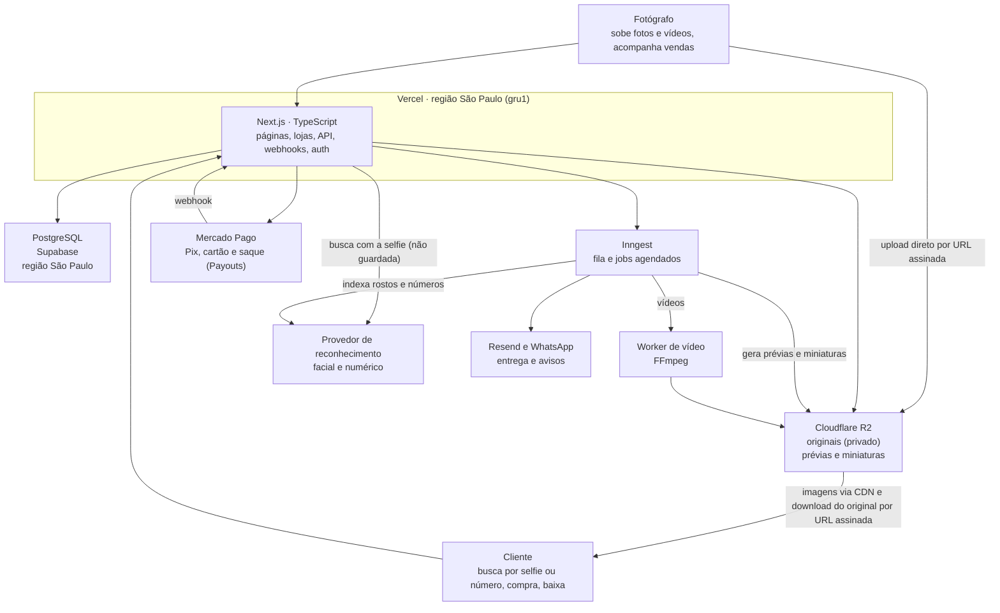

# Arquitetura — Plataforma de Venda de Fotos

Oct 6, 2026 · @gabriel

## Visão geral

Um marketplace onde fotógrafos sobem fotos e vídeos de eventos e clientes encontram e compram os seus, pela selfie, pelo número de peito ou navegando na galeria. O cliente paga na conta da plataforma; o fotógrafo saca pelo painel, e a comissão da plataforma sai no saque.

A referência de produto é a Fotto, resumida em [referencias/fotto.md](referencias/fotto.md). Ela orienta as decisões, mas não as fecha sozinha.

**Premissas adotadas:**

- Foco em fotos e vídeos de eventos (corridas, festas, formaturas, esportes), vendidos por item ou em pacote.
- Mercado brasileiro: preços em reais, pagamento por Pix e cartão, dados hospedados no Brasil.
- Fotos em JPEG, PNG, WebP, TIFF ou AVIF, entregues ao comprador no formato enviado, sem limite de tamanho além do teto técnico de 200 MB; HEIC/HEIF é convertido em JPEG no navegador antes do envio. RAW não é aceito: o fotógrafo exporta a foto final antes de enviar. Vídeos em MP4 ou MOV (até 500 MB e 5 minutos).

**Escopo do MVP:**

- Cadastro e login de fotógrafos e clientes; compra sem cadastro
- Fotógrafo cria um evento e sobe fotos e vídeos em lote
- Prévia com marca d'água e miniatura geradas automaticamente, para foto e vídeo
- Busca por reconhecimento facial (selfie) e numérico (número de peito), filtro por horário e lista de fotos não identificadas
- Galeria pública por evento, com pastas, ordenação, visibilidade (pública, não listada ou com senha) e liberação automática, manual ou agendada
- Carrinho com itens de vários eventos, checkout com Pix/cartão e download do original após o pagamento
- Descontos: cupons, desconto progressivo e pacote "todas as minhas fotos"
- Entrega automática por e-mail e por WhatsApp; recuperação de carrinho abandonado
- Fotógrafos colaboradores no mesmo evento, com divisão da venda
- Loja própria do fotógrafo, com nome, logo, cores e domínio
- Denúncia de evento ou foto, com moderação pela equipe
- Painel do fotógrafo com vendas, saldo e saque por Pix (normal em 30 dias ou antecipado em 1 dia)

**Fora do MVP:** app mobile, plugin do Lightroom, upload em tempo real, desfoque contra print, marca d'água personalizada, planos pagos para fotógrafos e os demais itens listados em [referencias/fotto.md](referencias/fotto.md#o-que-adotamos-no-mvp).

## Stack técnica

TypeScript de ponta a ponta, com Next.js no front e no back, PostgreSQL para os dados e Cloudflare R2 para os arquivos.

| Camada | Escolha | Por quê |
|---|---|---|
| Linguagem | TypeScript | Uma linguagem só no front e no back |
| Framework web | Next.js (App Router) | Páginas com SEO, API e webhooks no mesmo projeto |
| Banco de dados | PostgreSQL | Dados relacionais e transações seguras para pedidos e pagamentos |
| Acesso ao banco | Drizzle ORM | Leve, tipado e próximo do SQL |
| Arquivos | Cloudflare R2 | Compatível com S3 e sem custo de transferência de saída |
| Processamento de imagem | Sharp | Gera miniaturas e prévias com marca d'água |
| Processamento de vídeo | FFmpeg num worker separado | Prévia com marca d'água, capa e quadros para o reconhecimento; não cabe nas funções da Vercel |
| Reconhecimento facial e numérico | Amazon Rekognition (facial); provedor de OCR a decidir (números) | Indexa rostos das fotos numa coleção por evento e compara com a selfie, sem guardá-la |
| Fila de tarefas | Inngest | Processa uploads e roda os jobs agendados sem manter servidor de fila |
| Autenticação | Login com Google (OAuth 2.0 com PKCE) e e-mail e senha, sessão própria; Better Auth avaliado na Fase 11 | Usuários e sessões no nosso banco; papéis cliente, fotógrafo e gestor |
| Pagamento | Mercado Pago (Checkout Transparente via Orders + Payouts) | Pix e cartão dentro do site; saque do fotógrafo por Pix pela API |
| Interface | Tailwind CSS + shadcn/ui | Componentes prontos e fáceis de customizar |
| E-mail | Resend | Código de confirmação do cadastro, "Esqueci a senha", confirmação de compra, links de download e carrinho abandonado |
| WhatsApp | API oficial do WhatsApp (Cloud API ou parceiro) | Entrega automática do link de download |

## Componentes e deploy

O Next.js na Vercel é o centro: ele fala com o banco, a fila, o storage, o gateway e o provedor de reconhecimento. Os arquivos pesados nunca passam por ele.



O fotógrafo envia os arquivos direto ao R2; o cliente recebe prévias pela CDN e o original por um link temporário depois de pagar.

## Armazenamento das fotos e vídeos

Cada foto vira três arquivos no R2 e cada vídeo vira três ou quatro, separados em dois buckets: um privado para os originais e um público para o que aparece no site. O banco guarda só as chaves desses arquivos.

| Versão | Bucket | Tamanho aproximado | Uso |
|---|---|---|---|
| Original (foto) | `fotos-originais` (privado) | JPEG, PNG, WebP, TIFF ou AVIF, de 1 a 200 MB, no formato enviado (a chave leva a extensão do formato real) | Entregue só ao comprador, por URL assinada, com o tipo e a extensão do formato |
| Original (vídeo) | `fotos-originais` (privado) | MP4 ou MOV de até 500 MB | Entregue só ao comprador, por URL assinada |
| Prévia com marca d'água | `fotos-publicas` | Foto: 200 a 300 KB, 1600 px. Vídeo: 720p | Página do item e galeria ampliada |
| Miniatura | `fotos-publicas` | 30 a 50 KB, 400 px (no vídeo, um quadro de capa) | Grade da galeria |

**Padrão de nomes das chaves:**

```
envios/{fotografo_id}/{evento_id}/{foto_id}.jpg  # original chegando do navegador (privado, temporário)
originais/{fotografo_id}/{evento_id}/{foto_id}.{jpg|mp4|mov}
previas/{fotografo_id}/{evento_id}/{foto_id}.{webp|mp4}
miniaturas/{fotografo_id}/{evento_id}/{foto_id}.webp
denuncias/{denuncia_id}/{arquivo_id}          # anexos, no bucket privado
```

- `fotos.chave_original` guarda a chave no bucket privado (`envios/...` enquanto a foto está em `processando`, `originais/...` depois). `fotos.url_previa` e `fotos.url_miniatura` guardam as chaves no bucket público, e o endereço é montado na leitura com `R2_URL_PUBLICA` (`src/lib/url-publica.ts`): trocar o `r2.dev` por um domínio próprio não mexe no banco. Os dados de exemplo guardam caminhos `/exemplo/...`, que passam como estão.
- O prefixo `envios/` tem regra de ciclo de vida no R2 que apaga o que ficar lá mais de 1 dia (envio abandonado ou recusado); o original só vai para `originais/` depois de conferido.
- O acesso ao R2 fica em `src/lib/r2.ts` (API compatível com o S3, só no servidor). Sem as variáveis `R2_*`, o build e o site funcionam; o envio de fotos responde "Armazenamento de fotos não configurado" na produção e usa o envio simulado (imagens de exemplo) fora dela.

- Usar o `foto_id` (UUID) como nome evita colisão e não expõe o nome original do arquivo.
- O bucket público fica atrás de um domínio próprio na Cloudflare (ex.: `img.seusite.com.br`), com cache de CDN e sem listagem. As prévias de eventos com senha ou visíveis só após o reconhecimento também ficam nele: a proteção é o UUID impossível de adivinhar, não o bucket.
- O original nunca tem URL pública: o download usa uma URL assinada válida por cerca de 15 minutos, gerada só para quem comprou.
- Regra de retenção a decidir (a Fotto guarda por tempo indeterminado). Originais de itens vendidos seguem a regra de acesso do comprador (ver "Acesso às compras").

**Vídeos:**

- O processamento roda num worker com FFmpeg (container em Fly.io ou Railway), chamado pelo job do Inngest, porque as funções da Vercel não têm FFmpeg nem tempo para vídeos de 500 MB.
- O worker gera a prévia em 720p com marca d'água, a miniatura (um quadro do vídeo) e quadros a cada segundo para o reconhecimento facial e numérico. Os quadros são temporários e apagados depois da indexação.
- Vídeos não entram no desconto progressivo nem no pacote; cupons valem para eles.

## Modelo de dados

Valores em dinheiro ficam em centavos (inteiro) para evitar erro de arredondamento, e todos os IDs são UUID. A tabela `fotos` guarda fotos e vídeos, separados pela coluna `tipo`.

**Núcleo**

| Tabela | Campos principais | Relaciona com |
|---|---|---|
| `usuarios` | id, nome, email, telefone (opcional), papel (cliente, fotografo, admin), senha_hash (opcional: quem só usa Google não tem), google_id (opcional, único), email_confirmado_em, versao_sessao, mfa_segredo (TOTP cifrado, opcional), mfa_ativado_em, mfa_ultimo_passo, criado_em, excluido_em (opcional: conta excluída pelo próprio usuário, com os dados pessoais anonimizados) | — |
| `sessoes_revogadas` | jti (id da sessão do cookie), expira_em | — (lista das sessões encerradas por "Sair") |
| `codigos_recuperacao` | id, usuario_id, codigo_hash (HMAC, único), usado_em | usuarios (códigos de recuperação da verificação em duas etapas) |
| `codigos_email` | email (chave), usuario_id (opcional: conta antiga não confirmada), nome, senha_hash e papel (cadastro pendente), codigo_hash (HMAC), codigo_expira_em, tentativas, enviado_em, criado_em | usuarios (código de confirmação do e-mail; o cadastro pendente vence em 24 horas) |
| `redefinicoes_senha` | token_hash (SHA-256, chave), usuario_id, expira_em | usuarios (links de "Esqueci a senha") |
| `fotografos` | id, usuario_id, nome_publico, slug, bio, foto_perfil, capa, redes_sociais, cpf_cnpj, chave_pix (o próprio CPF/CNPJ, confirmado), documento_trocado_em (última troca do CPF/CNPJ), comissao_pct | usuarios (1:1) |
| `categorias` | id, nome, slug | — |
| `eventos` | id, fotografo_id (dono), categoria_id, titulo, slug, inicio_em, fim_em, local, cidade, estado, capa, preco_foto_centavos, preco_video_centavos, status (rascunho, publicado, revisao, arquivado), visibilidade (publico, nao_listado, senha), senha_hash, listado, fotos_so_apos_busca, liberacao (automatica, manual, agendada: padrão dos próximos envios), liberado_em (horário padrão da agendada), filtro_horario, listar_nao_identificadas, ordenacao | fotografos, categorias |
| `pastas` | id, evento_id, nome, ordem | eventos (N:1) |
| `fotos` | id, evento_id, pasta_id (opcional), enviada_por (fotografo_id), tipo (foto, video), chave_original, chave_previa, chave_miniatura, nome_arquivo, largura, altura, duracao_s (vídeo), tamanho_bytes, hash_conteudo, capturada_em, preco_centavos (opcional, sobrepõe o do evento), ordem, status (processando, pronta, erro), criado_em, excluida_em (opcional), rostos_indexados_em (opcional: já passou pelo reconhecimento facial, com ou sem rosto), liberacao (modo do lote), liberar_em (a partir de quando aparece; nulo = aguardando o dono), aviso_liberacao_em (aviso do lote agendado já enviado) | eventos, pastas, fotografos |
| `colaboradores` | id, evento_id, fotografo_id, comissao_dono_pct, nota | eventos, fotografos |

**Busca**

| Tabela | Campos principais | Relaciona com |
|---|---|---|
| `rostos` | id, foto_id, rosto_id_provedor, caixa (posição do rosto, para a prévia ampliada) | fotos (N:1) |
| `numeros` | id, foto_id, numero | fotos (N:1) |

A selfie do cliente não tem tabela: ela não é gravada em lugar nenhum.

**Vendas**

| Tabela | Campos principais | Relaciona com |
|---|---|---|
| `pedidos` | id, cliente_id (opcional), email_comprador, nome_comprador, whatsapp (opcional), aceita_whatsapp, token_acesso_hash, acesso_expira_em, cupom_id (opcional), subtotal_centavos, desconto_centavos, total_centavos, metodo (pix, cartao), status (pendente, pago, expirado, cancelado, estornado, contestado), expira_em, gateway_id, pix_copia_e_cola, pix_qr_code_base64, pago_em, lembrete_enviado_em, reembolso_solicitado_em, reembolso_solicitado_por, contestado_em, estornado_em, motivo_estorno (reembolso, chargeback) | usuarios (N:1, opcional), cupons |
| `itens_pedido` | id, pedido_id, foto_id, fotografo_id (quem recebe), preco_centavos, desconto_centavos, valor_fotografo_centavos, valor_dono_evento_centavos, via_pacote | pedidos, fotos, fotografos |
| `cupons` | id, fotografo_id, codigo, tipo (percentual, valor, fotos_gratis), valor, usos_max (opcional), usos, inicio_em, expira_em (opcional), minimo_tipo (nenhum, valor, quantidade), minimo_valor, todos_eventos, ativo | fotografos (N:1) |
| `cupons_eventos` | cupom_id, evento_id | cupons, eventos |
| `faixas_desconto` | id, fotografo_id, evento_id (vazio = padrão para todos os eventos), quantidade_min, desconto_pct | fotografos, eventos |
| `pacotes` | id, evento_id, tipo_preco (fixo, por_foto), preco_centavos, mostrar_a_partir_de (opcional), expira_em (opcional), ativo | eventos (1:1) |
| `downloads` | id, item_pedido_id, baixado_em, ip | itens_pedido (N:1) |

**Dinheiro do fotógrafo**

| Tabela | Campos principais | Relaciona com |
|---|---|---|
| `lancamentos` | id, fotografo_id, item_pedido_id, valor_centavos (bruto; negativo em estorno), disponivel_em (venda + 30 dias), antecipavel_em (venda + 1 dia), saque_id (opcional), estorno_de (opcional, único: o lançamento que este desfaz) | fotografos, itens_pedido, saques, lancamentos |
| `saques` | id, fotografo_id, antecipado, bruto_centavos, taxa_centavos, liquido_centavos, chave_pix, gateway_id (payout), status (processando, pago, falhou), criado_em, pago_em | fotografos (N:1) |

**Crescimento do fotógrafo**

| Tabela | Campos principais | Relaciona com |
|---|---|---|
| `metricas` | id, tipo (visita_evento, visita_foto, carrinho), evento_id, foto_id (opcional), em. Nada de quem visitou: sem IP, cookie ou usuário | eventos, fotos |
| `modelos_evento` | id, fotografo_id, nome, config (categoria, local, preços, visibilidade sem senha, liberação, filtros, ordenação), criado_em | fotografos (N:1) |

O dashboard e o desempenho saem das tabelas de vendas e de `metricas`. Conversão é pedidos pagos ÷ visitas ao evento. Fotos repetidas no envio são achadas pela impressão do arquivo (SHA-256 do tamanho e de três trechos de 1 MB: início, meio e fim; o arquivo inteiro se tiver até 3 MB), calculada no navegador, conferida no servidor e guardada em `fotos.hash_conteudo` (`src/lib/impressao-arquivo.ts`, com o risco de falso positivo descrito lá). Fotos enviadas antes de 09/10/2026 têm o SHA-256 inteiro: reenviar uma delas cria outro item em vez de ser pulada.

**Loja e moderação**

| Tabela | Campos principais | Relaciona com |
|---|---|---|
| `lojas` | id, fotografo_id, nome, descricao, logo, cor_primaria, cor_secundaria, subdominio, dominio_proprio (opcional), dominio_verificado, ga_id, gtm_id, ativa | fotografos (1:1) |
| `denuncias` | id, alvo_tipo (evento, foto), evento_id, foto_id (opcional), motivo, descricao, contato_email, contato_telefone, razao_social, cnpj, status (recebida, em_analise, procedente, improcedente), decidida_por, criado_em | eventos, fotos |
| `anexos_denuncia` | id, denuncia_id, chave | denuncias (N:1) |

- `itens_pedido` grava o preço, o desconto e a divisão no momento da compra; se o fotógrafo mudar o preço depois, o histórico não muda.
- `pedidos.gateway_id` liga o pedido à order no Mercado Pago (`ORD…`); a order leva o id do pedido em `external_reference`.
- `lancamentos` é o extrato do fotógrafo, em valor bruto: a comissão não sai na venda, e sim no saque. Disponível = sem saque e com `disponivel_em` passado; antecipável = com `antecipavel_em` passado e `disponivel_em` ainda não; o resto ainda não pode ser sacado. O prazo é o mesmo para Pix e cartão.
- **Exclusão lógica de fotos:** quando o fotógrafo apaga uma foto ou vídeo, o sistema preenche `fotos.excluida_em` em vez de apagar a linha. O item some da galeria (todas as consultas públicas filtram `excluida_em IS NULL`), mas quem já comprou continua baixando. O original só é apagado do R2 se o item não tiver nenhuma venda paga.
- **Índices iniciais:**
  - `fotos(evento_id, ordem)` e `fotos(evento_id, capturada_em)`
  - `fotos(evento_id, hash_conteudo)`, para achar duplicados
  - `fotos(evento_id, liberar_em)`, para a galeria e o resumo da liberação
  - `eventos(slug)` — único
  - `numeros(numero, foto_id)` e `rostos(rosto_id_provedor)`
  - `pedidos(cliente_id)` e `pedidos(status, expira_em)`
  - `pedidos(gateway_id)` — **único**: o webhook busca o pedido por essa coluna, e a restrição impede dois pedidos com o mesmo pagamento
  - `itens_pedido(foto_id)`
  - `cupons(fotografo_id, codigo)` — único
  - `lojas(subdominio)` e `lojas(dominio_proprio)` — únicos
  - `lancamentos(fotografo_id, saque_id)`
  - `saques(fotografo_id, status)`

## Fluxos principais

O pagamento só é considerado confirmado quando o servidor lê a order na API do Mercado Pago e confere a referência e o valor, nunca pelo retorno do navegador.

**Upload (fotógrafo ou colaborador)**

1. O fotógrafo escolhe o evento (e a pasta, se quiser) e seleciona os arquivos.
2. Sem limite de quantidade de fotos por envio nem por evento. O navegador confere cada arquivo pelos primeiros bytes (`src/lib/tipos-imagem.ts`, o mesmo código no servidor): JPEG, PNG, WebP, TIFF e AVIF seguem; HEIC/HEIF é convertido em JPEG de alta qualidade (95%) no navegador antes do envio; RAW (CR2, CR3, NEF, ARW, DNG, RAF, ORF, RW2 e outros, pelo cabeçalho ou pela extensão) é recusado com "Arquivo RAW: exporte em JPEG (ou PNG/TIFF) no Lightroom/Capture One antes de enviar". Na hora de enviar, calcula a impressão de cada arquivo (~3 MB lidos por foto, em vez do arquivo inteiro). Em lotes automáticos (o primeiro de 10, para o envio começar logo; depois de até 50, `FOTOS_POR_LOTE` em `src/lib/limites-envio.ts`, só o tamanho de cada chamada), a Server Action `iniciarEnvioAcao` confere se o fotógrafo é dono ou colaborador do evento, pula as fotos que já estão prontas no evento (mesma impressão), cria cada registro em `fotos` com status `processando`, a impressão e a chave temporária `envios/<...>.<extensão do formato>`, e devolve uma URL assinada de PUT (15 min, com o `Content-Type` do formato e o tamanho na assinatura) ou, a partir de 50 MB, um upload em partes (abaixo). Uma foto do mesmo fotógrafo e mesma impressão que ficou em `processando` ou `erro` é reaproveitada, para "tentar de novo" não duplicar itens.
   - **Tamanho:** sem o antigo limite de 30 MB. Só tetos técnicos: 200 MB por arquivo (`LIMITE_FOTO_BYTES`: o arquivo inteiro fica na memória da função de processamento, de 2 GB no plano Hobby, e cobre um TIFF de 8 bits sem compressão de 61 MP ou de 16 bits com compressão de 45-60 MP) e 160 megapixels (`LIMITE_PIXELS`, o `limitInputPixels` do Sharp: cobre câmeras de 150 MP e barra a "bomba de descompressão").
   - **Upload em partes (multipart):** a partir de 50 MB (`MULTIPART_A_PARTIR_DE`), o servidor abre o upload no R2 (CreateMultipartUpload, com o tipo do formato) e assina uma URL de PUT por parte de 10 MB (`TAMANHO_PARTE`, tamanho exato na assinatura). O navegador manda as partes direto ao R2, 4 por arquivo dentro das vagas gerais, e guarda o ETag de cada uma (o CORS do bucket já expõe o `ETag`); uma parte que falha é reenviada sozinha, e as partes cuja URL venceu são reassinadas pela rota `POST /api/envios/partes` (`acao: "assinar"`) sem perder as já enviadas. No fim, a mesma rota (`acao: "concluir"`) fecha o upload (CompleteMultipartUpload) exigindo todas as partes de 1 a N, com N tirado do tamanho registrado; se o upload não vale mais, o navegador recomeça com outro. O arquivo nunca passa pelo Next.js: a rota só recebe ids, números e ETags (corpo de até 8 KB). Upload em partes abandonado é descartado pelo próprio R2 (multipart incompleto some em 7 dias).
3. O navegador envia os arquivos direto ao bucket privado, sem passar pelo servidor, com até 4 tentativas por arquivo (espera crescente; URL vencida ou recusada é pedida de novo) e a fila seguindo depois de um erro. A quantidade de PUTs ao mesmo tempo é adaptativa (`src/lib/concorrencia-adaptativa.ts`): começa em 6 (10 com arquivos de até 5 MB), mede a vazão a cada 5 segundos e sobe ou desce um degrau entre 4 e 10 (6 e 16 com arquivos pequenos), mantendo a direção que melhorou a vazão. Os lotes de URLs são pedidos à frente, enquanto os arquivos sobem. Em "Detalhes técnicos", a tela mostra os tempos médios por foto de cada etapa (impressão, conversão HEIC, pedido de URLs, envio em MB/s, envios simultâneos, reenvios e processamento, com as etapas do servidor), só números, com um botão para copiar e mandar ao suporte. O bucket fica em Eastern North America (o R2 não tem região na América do Sul): cada ida e volta a partir do Brasil custa ~150 ms, o que pesa mais nos arquivos pequenos; por isso a concorrência maior com eles e o GET sem HEAD antes no processamento.
4. Assim que um arquivo chega, o navegador pede o processamento à rota `POST /api/envios/processar` (uma foto por chamada), até 10 ao mesmo tempo, e já segue subindo os próximos: o processamento fica fora do caminho do envio. Quando o último upload termina, as fotos que ainda esperam processamento são entregues ao servidor de uma vez (`{ fotoIds }`, até 100 por chamada, resposta 202 na hora): a rota as processa depois da resposta (`after`, até 240 s dos 300 s da função, 6 ao mesmo tempo) e a página pode fechar. Se a página fechar no meio do envio, as que já subiram vão do mesmo jeito por `sendBeacon`. A resposta de cada foto sai assim que prévia, miniatura e original estão no lugar; o cadastro dos rostos roda depois da resposta (`after`). Toda chamada é idempotente: antes de processar, a foto é reservada num UPDATE atômico (`src/dados/processamento.ts`, que empurra `fotos.envio_iniciado_em` para o fim da reserva, 3 minutos); quem perde a reserva, ou chega com a foto já pronta, responde "em andamento" sem refazer prévias nem rostos. É uma rota, e não uma Server Action, porque o Next despacha as Server Actions de uma página uma por vez; antes, com a confirmação numa Server Action, as fotos eram processadas em fila única e o envio esperava. A rota confere a origem (mesmo site), a sessão e o dono da foto, e só recebe o id. A tela não fala das etapas nem do formato dos arquivos: mostra um círculo que se preenche com a porcentagem no meio e "12 de 32 fotos" embaixo (`src/components/painel/circulo-progresso.tsx`), a velocidade e o tempo restante enquanto sobe e só as fotos com problema. A porcentagem (`src/lib/progresso-envio.ts`) dá a cada foto o mesmo peso, 70% para a subida ao R2 (pelos bytes) e 30% para ficar pronta, e só chega a 100% quando todas estão prontas, com erro ou puladas por repetidas; as fotos entregues ao servidor de uma vez são acompanhadas pela Server Action `situacaoDoEnvioAcao` (só leitura, só das fotos de quem enviou, até 500 por consulta) a cada 2,5 s, até ficarem prontas ou ficarem 5 minutos sem novidade. No fim, um check e "32 fotos prontas" (ou "30 fotos prontas · 2 com erro", com a lista e o "Tentar de novo"); sem problema, a tela volta sozinha para a área de escolher fotos depois de 6 s. A grade do painel mostra a foto que ainda não ficou pronta como um espaço esmaecido, sem rótulo, e se atualiza sozinha. Depois o processamento pode ir para um job no Inngest.
5. O servidor baixa o arquivo temporário numa ida só (GET; maior que o teto nem é baixado), confere o tamanho (o mesmo informado no início), o formato real pelos bytes (o mesmo informado; RAW e HEIC recusados), a impressão informada no início e o limite de pixels, e lê largura, altura e a data de captura do EXIF. Com o Fluid Compute, uma instância pode processar várias fotos ao mesmo tempo: um orçamento de 600 MB de arquivos por instância (`ORCAMENTO_DE_MEMORIA_BYTES`) faz quem não cabe esperar a vez em vez de estourar os 2 GB. A rota responde os tempos de cada etapa (só números) para a telemetria da tela.
6. Foto: gera prévia com marca d'água e miniatura com Sharp, sempre no servidor, grava as duas no bucket público e move o original de `envios/` para `originais/`; depois cadastra os rostos no reconhecimento. O original é decodificado uma vez só, já reduzido (o libjpeg lê em 1/2, 1/4 ou 1/8; nos outros formatos, leitura sequencial em faixas, sem a imagem inteira na memória), girado pelo EXIF, com a transparência achatada sobre branco e em sRGB de 8 bits (TIFF e PNG de 16 bits também); prévia, miniatura e a cópia do reconhecimento saem dessa base em pixels crus, e o padrão de marcas fica em memória por tamanho de foto (`src/servicos/imagens.ts`). Vídeo: chamará o worker de FFmpeg.
7. Marca o item como `pronta`. Em qualquer falha, o item fica em `erro` (fora da galeria) com o motivo em `fotos.erro_mensagem` (mostrado na grade do painel), o arquivo recusado é apagado e a tela mostra o motivo com "Tentar de novo".
8. Foto que ficou em `processando` (navegador fechado, função que morreu no meio) é revisada pelo job `/api/jobs/revisao` (GitHub Actions, agendado a cada 10 minutos, mas o GitHub atrasa ou pula execuções: em produção houve intervalos de 2 a 5 horas): passados 5 minutos de `fotos.envio_iniciado_em` (ou do fim da reserva), ele reserva a foto e refaz o passo 5 em diante; se o arquivo chegou e confere, a foto fica `pronta`; se não chegou e o envio começou há menos de 30 minutos (a URL de envio vale 15), a reserva é desfeita e a foto espera a próxima execução; senão, `erro` com a mensagem. Processa 6 ao mesmo tempo até 80 s por execução (centenas de fotos), dentro do `maxDuration` de 120 s; sem o R2 configurado, não faz nada. Ainda falta: enviar a foto (ou os quadros do vídeo) ao provedor de reconhecimento e gravar os rostos e números encontrados.

**Liberação das fotos**

O fotógrafo decide quando as fotos que sobe ficam visíveis e à venda. Cada foto guarda o próprio horário (`fotos.liberar_em`, em UTC) e o modo do lote em que entrou (`fotos.liberacao`), então lotes diferentes do mesmo evento podem ter horários diferentes. Regras puras em `src/lib/liberacao.ts`; banco em `src/dados/liberacao.ts`.

- **Modos:** automática (`liberar_em` = momento do envio: a foto aparece assim que fica `pronta`); manual (`liberar_em` nulo: fica só no painel até o "Liberar agora"); agendada (`liberar_em` = data e hora escolhidas).
- **Onde se escolhe:** o padrão do evento fica em Configurações (e no "Novo evento"; um modelo com liberação agendada vira automática, porque a data não se repete). Na hora de enviar, o dono pode trocar o modo só para aquele lote; o padrão já vem marcado. Mudar o horário padrão leva junto as fotos ainda agendadas para o horário antigo; os outros lotes não mudam. Trocar o modo padrão não mexe nas fotos já enviadas.
- **Colaboradores:** quem decide é o dono. O colaborador envia seguindo o padrão do evento (a escolha que ele mandar é ignorada no servidor) e vê na tela qual é; liberar, agendar e cancelar são só do dono (`mudarLiberacao` confere o dono no WHERE).
- **Painel do evento:** no topo, "X liberadas · Y agendadas (próxima às HH:MM de DD/MM) · Z aguardando" e o botão "Liberar as N fotos pendentes agora". Na lista de fotos, cada foto mostra "Liberada", "Agendada para 16:00 de 10/10" ou "Aguardando liberação (manual)", com filtro por estado; o dono escolhe fotos (ou age sobre todas as ainda não liberadas) e libera agora, agenda ou reagenda, ou cancela o agendamento (volta ao manual). Foto já liberada não volta a ficar escondida.
- **Fuso:** a entrada é sempre em horário de Brasília (`datetime-local`, "16:00" vira 19:00 UTC) e a tela mostra em Brasília. Horário no passado não é aceito para agendar: a tela oferece "Liberar agora" (ou, no envio, "Liberar ao ficarem prontas"). Um horário que passa no meio de um envio longo continua valendo: as fotos que ficarem prontas depois já aparecem. O horário é sempre calculado no servidor, e a entrada passa pelo Zod (`mudarLiberacaoAcao`, `iniciarEnvioAcao`, `enviarFotosAcao`, `salvarEventoAcao`).
- **Precisão de minuto, sem cron:** toda consulta pública filtra no banco por `status = pronta`, `excluida_em` nulo e `liberar_em <= hora da requisição` (`itemVisivel` em `src/dados/index.ts`): galeria, filtros e contagens, capa e total de itens das listagens e da loja própria, página da foto (e o OG dela), busca por selfie e por número (e os recortes de rosto), carrinho, checkout e criação do pedido (`buscarItensParaCompra`: foto não liberada some do cálculo e o pedido é recusado como `itens_indisponiveis`). A hora vem do relógio do servidor (`Date.now()` depois de `connection()`), não do `now()` do banco, para os testes simularem o relógio; a diferença entre os dois é de milissegundos.
- **Cache:** nenhuma página ou consulta pública usa `"use cache"`, `unstable_cache` ou `revalidate`; todas leem a hora com `connection()` e são renderizadas por requisição (com Cache Components, isso as tira da pré-renderização), então nada segura a foto escondida depois do horário nem a mostra antes. Não há sitemap. A página do evento recarrega sozinha no horário (contagem regressiva quando nada foi liberado; "Mais fotos chegam em …" quando já há fotos liberadas), e a lista do painel também. Se um dia entrar cache numa consulta de fotos, ele precisa expirar no próximo `liberar_em` do evento.
- **Evento publicado e foto liberada:** a foto só aparece com as duas coisas: evento `publicado` e foto liberada. Liberar num rascunho é permitido (o painel avisa que só aparecem depois de publicar); arquivar ou mandar para revisão esconde tudo, inclusive as liberadas. Sem nenhuma foto liberada e com fotos esperando, a página do evento mostra a contagem regressiva até o próximo horário agendado ou o aviso de liberação manual.
- **Aviso:** quando um lote agendado chega ao horário, o job de pedidos (`/api/jobs/pedidos`, a cada 10 minutos) manda um e-mail ao dono e aos colaboradores que aceitaram (registrado na caixa de saída, tipo `liberacao`). O mesmo UPDATE que escolhe os lotes marca `aviso_liberacao_em`, então repetir o job não repete o aviso. Liberação manual ou antecipada pelo dono não gera aviso; evento fora do ar também não. As fotos já apareceram no minuto certo: o job só avisa. Não há seguidores de evento nem WhatsApp para fotógrafos (ver tarefas).

**Galeria e busca (cliente)**

1. O cliente abre a página do evento, renderizada no servidor para ser indexada pelo Google. Eventos com senha pedem a senha antes; eventos não listados ficam fora das listagens e do sitemap.
2. O banco devolve os itens prontos, liberados e não excluídos, paginados por cursor, na ordenação escolhida pelo fotógrafo; as imagens vêm da CDN.
3. Busca facial: o cliente tira ou envia uma selfie, aceitando o aviso de uso de dado biométrico. O navegador manda a imagem ao servidor, que a repassa ao provedor para buscar na coleção do evento e devolve os itens encontrados. A selfie fica só na memória da requisição: não vai para o banco, o R2 nem os logs.
4. Busca numérica: consulta direta em `numeros`.
5. Filtro por horário: consulta por `capturada_em` entre a hora de início e a de fim (horário de Brasília).
6. Se o evento tem `fotos_so_apos_busca`, a galeria aberta fica vazia e só os resultados da busca aparecem.
7. Itens sem rosto nem número aparecem em "não identificadas", se o fotógrafo deixou ligado.

**Compra e pagamento**

1. O carrinho fica no navegador e aceita itens de vários eventos e fotógrafos.
2. No checkout, o cliente informa nome, e-mail e, se quiser, o WhatsApp (com consentimento), aplica um cupom e escolhe Pix ou cartão.
3. O servidor busca preços e regras no banco e calcula os descontos nesta ordem:
   - Pacote, se ativo e escolhido: substitui o preço das fotos do evento e não se combina com cupom nem com desconto progressivo. Vale só para as fotos que a busca encontrou: a busca devolve um token assinado (HMAC com `APP_SECRET`, válido por 7 dias) com o evento e os ids encontrados, o carrinho guarda o token e o servidor confere a assinatura e exige todas essas fotos no carrinho. Sem isso, qualquer conjunto de fotos poderia sair pelo preço do pacote.
   - Desconto progressivo, por evento, só sobre as fotos.
   - Cupom, sobre o resultado, só nos itens dos eventos do fotógrafo que o criou. No tipo "fotos grátis", isenta as fotos de menor preço. O uso só é somado quando o pagamento é confirmado, na mesma transação que marca o pedido como `pago` e com `usos < usos_max` na condição do UPDATE; repetir o webhook não soma de novo. Se o limite estourou entre a criação do pedido e o pagamento (outro pedido usou a última vez), o pedido continua pago, porque o cliente já pagou com o desconto: o uso não passa do limite, o caso vai ao log como alerta (`ALERTA cupom usado além do limite`) e não há estorno automático.
   - Descontos percentuais são arredondados para baixo, item a item; descontos em valor (pacote, cupom em reais) são repartidos entre os itens sem perder centavo. Cada item guarda o próprio desconto, e a divisão entre autor e dono do evento é feita sobre o valor pago.
4. O servidor cria o `pedido` como `pendente`. No Pix, já cria a order no Mercado Pago (`POST /v1/orders`, chave de idempotência pelo id do pedido) e guarda o QR Code no pedido; o Pix expira em 1 hora, no Mercado Pago e em `pedidos.expira_em`.
5. No cartão, a página do pedido mostra o Card Payment Brick do Mercado Pago: os campos do cartão são iframes deles, e o navegador só entrega ao servidor um token de uso único. O servidor cria a order à vista (1 parcela) com o total do pedido; se for recusada, o cliente tenta outro cartão no mesmo pedido.
6. O Mercado Pago chama o webhook (`/api/webhooks/mercadopago`, evento "Order"). O webhook valida a assinatura (`x-signature`, HMAC-SHA256, recusando `ts` com mais de ~5 minutos de diferença do relógio do servidor), lê a order na API (o corpo da notificação não vale), confere `external_reference` e `total_amount` com o pedido, marca como `pago` e soma o uso do cupom numa única transação (só se ainda estiver `pendente`) e depois cria os `lancamentos` de cada fotógrafo.
7. A página do pedido se atualiza a cada 5 segundos enquanto espera e confere a order na API do Mercado Pago (no máximo uma consulta a cada 5 segundos por pedido). Isso cobre o webhook que atrasou ou nunca chegou, e o ambiente local, onde o Mercado Pago não alcança o webhook.
8. Um job envia o e-mail com o link de downloads e, se o cliente aceitou, a mensagem de WhatsApp com o mesmo link.

**Login e papéis**

| Papel | O que faz | Onde |
|---|---|---|
| Cliente | Compra e baixa | Minhas compras |
| Fotógrafo (vendedor) | Cria eventos, envia e publica fotos, acompanha vendas e saca | `/painel` |
| Gestor (admin) | Vê vendas, saques e usuários de todos e muda o papel de qualquer usuário. Também vende com a própria conta, como fotógrafo (não compra: ver o item 9) | `/admin` e `/painel` |

1. O login pode ser com o Google ou com e-mail e senha. O Google usa o fluxo de código com PKCE e `state` num cookie de 10 minutos; o servidor troca o código e lê o perfil direto no Google, e só aceita e-mail verificado. O endereço de volta vem de `APP_URL`, nunca do cabeçalho Host.
2. O usuário é procurado pela conta Google (`usuarios.google_id`, o `sub` do Google); se não existir, pelo e-mail, e as contas são ligadas. Se a conta com aquele e-mail nunca confirmou o e-mail, a senha e as sessões dela caem ao ligar: alguém pode ter criado a conta com o e-mail de outra pessoa.
3. Conta nova pelo Google nasce como cliente, ou como fotógrafo pelo botão "Vender fotos com Google". E-mails em `ADMIN_EMAILS` entram como gestores. As compras feitas como convidado com o mesmo e-mail são ligadas à conta. O Google já confirmou o e-mail, então não há código; um cadastro com senha que esperava o código para o mesmo e-mail é descartado.
4. **Cadastro com senha e confirmação por código** (`src/servicos/confirmacao-email.ts`). O formulário de `/cadastro` (cliente ou fotógrafo) não cria a conta: nome, hash da senha e tipo de conta ficam em `codigos_email` como cadastro pendente, e um código de 6 dígitos (gerador criptográfico, só o HMAC no banco, chave derivada do `APP_SECRET`) vai por e-mail. A pessoa digita o código em `/cadastro/codigo` (campo numérico com `autocomplete="one-time-code"`, que envia sozinho aos 6 dígitos); um cookie assinado de 24 horas (`clicouai_confirmacao`) só diz qual e-mail espera o código. Com o código certo, a conta nasce em `usuarios` já confirmada (fotógrafo ganha o perfil de vendedor), as compras de convidado com o mesmo e-mail são ligadas e a sessão abre (ou segue para o código do app, se a verificação em duas etapas estiver ligada). Regras: o código vale 15 minutos e uma vez só (a linha é apagada com o hash conferido, então dois envios ao mesmo tempo não confirmam duas vezes); cada código aceita 5 tentativas e depois só um código novo serve; reenviar espera 60 segundos (o código anterior continua valendo nesse meio-tempo) e conta nos limites `codigo_email_envio_email` (5 por hora) e `codigo_email_envio_ip` (20 por hora); digitar códigos conta em `codigo_email_conferencia_ip` (30 em 15 minutos). **Decisão:** cadastro pendente numa tabela, em vez de conta criada com `email_confirmado_em` nulo. Assim, quem desiste (ou quem digitou o e-mail de outra pessoa) não prende o endereço: refazer o cadastro troca os dados e o código, o job de pedidos apaga os pendentes com mais de 24 horas, e só a dona da caixa de entrada transforma o cadastro em conta. O custo é que o e-mail em uso só é conferido contra contas confirmadas, então dois cadastros pendentes para o mesmo e-mail se sobrepõem (vale o último).
5. **Login de conta não confirmada.** Com a senha certa, o login de um cadastro pendente ou de uma conta antiga (criada antes da confirmação obrigatória, com `email_confirmado_em` nulo) manda o código (respeitando a espera de 60 segundos) e leva a `/cadastro/codigo`; a sessão só abre com o código. Senha errada e e-mail inexistente continuam com a mesma resposta, então só quem sabe a senha descobre que a conta existe. A leitura da sessão recusa conta sem e-mail confirmado: cookies de antes da mudança deixam de valer. Os gestores de `GESTORES` são gravados confirmados a cada início do servidor. Sem o Resend, fora da produção (desenvolvimento local e testes), o código aparece só no log do servidor (`[desenvolvimento] …`) e a tela avisa isso; na produção (`VERCEL_ENV=production`) sem o Resend, o cadastro falha com "Não conseguimos enviar o código de confirmação agora" e nenhuma conta é liberada. O código nunca vai para a caixa de saída (`/admin/mensagens`).
6. **Esqueci a senha** (`src/servicos/redefinicao-senha.ts`). Link "Esqueci a senha" em `/entrar` leva a `/entrar/esqueci-senha`. A resposta é sempre a mesma ("se houver uma conta com esse e-mail, enviamos um link"), e a busca e o envio rodam depois da resposta (`after`), então nem o tempo revela quem tem conta. Limites `esqueci_senha_ip` (10 por hora) e `esqueci_senha_email` (3 por hora). Conta com senha: um token aleatório de 32 bytes, guardado só como SHA-256 em `redefinicoes_senha`, vale 30 minutos e uma vez só; o link é `/entrar/nova-senha#token=…`, com o token depois do `#`, que o navegador não manda ao servidor (fora dos logs de acesso, do Referer e do Sentry, que também apaga `#token=` por garantia); a tela lê o token, tira do endereço e o envia no corpo do formulário. Conta só com o Google: o e-mail explica que ela entra com o Google. Gestor de `GESTORES`: o e-mail explica que a senha vem da variável. Conta excluída ou inexistente: nada é enviado. Ao redefinir (`redefinir_senha_ip`, 20 em 15 minutos): senha nova com a regra do cadastro e repetida, só o hash gravado, todas as sessões derrubadas (o hash entra na versão da sessão e `versao_sessao` sobe), os outros links pendentes apagados, as tentativas de login daquele e-mail zeradas e um aviso por e-mail (tipo `seguranca`, sem o token nem a senha). Abrir o link prova que a pessoa recebe os e-mails do endereço: uma conta antiga não confirmada fica confirmada e as compras de convidado são ligadas. Depois, a pessoa entra com a senha nova (e o código do app, se ligado).
7. Cada página e ação confere o papel no servidor (`exigirFotografo`, `exigirGestor`); o menu só esconde links. Ninguém muda o próprio papel, com uma exceção: o cliente logado pode passar a fotógrafo com a mesma conta ("Ativar minha conta de fotógrafo" em `/cadastro?tipo=fotografo`; o `/painel` leva cliente para lá), como já acontece no botão "Vender fotos com Google". Ganha o perfil de vendedor vazio e deixa de comprar com essa conta (item 9; as compras já feitas continuam abrindo pelo link do e-mail); nunca vira gestor nem volta a cliente por conta própria.
8. O gestor usa o painel do fotógrafo com a própria conta de fotógrafo, criada no primeiro acesso ao `/painel` (nome dele, slug único, CPF e chave Pix vazios para completar em Perfil e recebimento; `fotografos.usuario_id` único impede duas contas em acessos simultâneos). Não é personificação: ele só mexe nos próprios eventos, fotos e saques, colaboração continua exigindo convite e o saque segue as mesmas regras (só para a chave Pix do próprio CPF/CNPJ). Os dados de outros vendedores ele vê só no `/admin`. Se deixar de ser gestor, perde o painel como qualquer cliente; a conta de fotógrafo fica, sem acesso.
9. **Experiência de quem vende** (`src/lib/navegacao.ts`). Fotógrafo e gestor logados têm cabeçalho próprio em todas as páginas, inclusive nas de cliente (como `/conta/seguranca`) e nas públicas de evento, foto e fotógrafo: faixa azul fina no topo, fundo branco, logo levando ao `/painel` (o gestor, dentro de `/admin/*`, volta ao `/admin`), atalhos Início, Meus eventos, Financeiro, Desempenho e Minha loja (o gestor também tem Gestão), selo da meta na mesma linha (para quem tem conta de fotógrafo, inclusive o gestor que também vende; em tela larga), nome levando a Perfil e recebimento e Sair; no celular, um menu com os mesmos itens mais Metas, Senha e segurança e Ajuda. Sem carrinho, Início, Eventos nem Minhas compras, e com o rodapé curto (Ajuda, Termos, Privacidade). Visitante e cliente continuam com o cabeçalho e o rodapé do site. A escolha fica numa função pura, `linksDoCabecalho`, e o cabeçalho inteiro sai dentro de um `<Suspense>` com só o logo no lugar, para não piscar o menu de visitante. Quem vende cai no painel: depois do login (`inicioDoPapel`), e `/` e `/eventos` respondem 307 para `/painel` e `/painel/eventos` (o gestor, de `/` para `/admin`); `/entrar` e `/cadastro` abertos com a sessão levam à área do papel ou ao `?proximo=` seguro (o cliente continua no `/cadastro`, onde pode ativar a venda). O redirecionamento fica na própria página, que espera a sessão antes de qualquer conteúdo (`instant = false`), e não no `proxy.ts`, que não conhece o papel e reescreve `/` para as lojas por host. **Conta de fotógrafo não compra fotos:** quem quiser comprar sai da conta (ou usa uma conta de cliente). A regra vale no servidor: a ação do checkout recusa a sessão de fotógrafo ou de gestor, e `criarPedido` lê o papel do `clienteId` no banco e recusa com `conta_sem_compra`. `/carrinho`, `/checkout` e Minhas compras mostram, para quem vende, uma página curta com "Sair da conta" (volta ao carrinho como convidado) e o link do painel; nas páginas de evento e de foto, os botões de compra e o pacote dão lugar ao aviso "Você está vendo como fotógrafo; para comprar, saia da conta". As páginas de pedido por token (`/pedidos/...`) não mudam.

**Painel de gestão (`/admin`)**

Visão geral (o que entrou em vendas pagas, o que saiu em saques, a receita da plataforma em taxas, o que ainda é devido aos fotógrafos e uma linha por vendedor), todas as vendas (com reembolso e a lista de estornos e contestações), o histórico de todos os saques (com a chave Pix mascarada) e os usuários com o papel de cada um.

**Busca por selfie**

1. Na página do evento, o botão "Buscar pelo meu rosto" abre um modal. A pessoa aceita o aviso de uso da selfie e escolhe "Tirar foto" (abre a câmera frontal; só aparece no celular e no tablet, porque no computador o navegador abriria o mesmo seletor de arquivos) ou "Carregar foto" (uma foto da galeria). O navegador reduz a imagem a 1024 px e a regrava em JPEG, o que descarta os metadados. Ao encontrar fotos, o modal fecha e a página rola até o resultado.
2. `POST /api/busca-facial` confere o consentimento, o tipo real da imagem (JPEG, PNG ou WebP, até 5 MB) e o limite de 10 buscas por IP a cada 10 minutos.
3. Com o Amazon Rekognition, a selfie vai para `SearchFacesByImage` na coleção do evento (`{prefixo}-{evento_id}`), com semelhança mínima de 90% por padrão (ajustável entre 80 e 99 por `REKOGNITION_SEMELHANCA`: em foto de evento a mesma pessoa costuma dar entre 85 e 95, e 95 escondia fotos certas). O Rekognition não guarda a imagem da busca. As credenciais vêm de `REKOGNITION_REGIAO`, `REKOGNITION_ACCESS_KEY_ID` e `REKOGNITION_SECRET_ACCESS_KEY`, passadas direto ao cliente (nunca das `AWS_*`, que a Vercel preenche com a região da função e credenciais da plataforma). Sem elas, os rostos dos dados de exemplo simulam o resultado (em produção, a busca responde "indisponível").
4. A selfie fica só na memória da requisição, é zerada no fim e nunca vai para log, banco ou R2. Volta a lista de fotos do evento em que a pessoa aparece, com a mesma regra de visibilidade da galeria (evento com senha ou aguardando liberação não abre; foto ainda não liberada nunca volta).
5. A indexação (`IndexFaces`, com o id da foto como `ExternalImageId`) roda no job de processamento quando o upload real existir (Fase 12).

**Divisão da venda com colaboradores**

Para cada item vendido: se o item foi enviado por um colaborador, o dono do evento fica com `comissao_dono_pct` do preço e o colaborador com o resto; se foi o próprio dono, ele fica com tudo. A comissão da plataforma não sai aqui: cada um paga a sua no saque. A soma das partes tem que dar exatamente o preço do item; os centavos de arredondamento ficam com o autor da foto.

**Desempenho do evento**

`/painel/eventos/[id]/desempenho` reúne as vendas, o público e os ganhos de um evento. Só pedidos `pago` contam como venda, e a foto excluída depois da venda continua nas vendidas (mas sai das carregadas). O dono vê o evento inteiro. O colaborador que aceitou o convite vê a mesma tela restrita ao que é dele: fotos que enviou (`fotos.enviada_por`), vendas, maior pedido, última venda e downloads só dos itens de que é autor (`itens_pedido.fotografo_id`) e ganhos só dos lançamentos dele; faturamento do evento, ganho do dono e números dos outros colaboradores nunca chegam a ele. Visitas e o Top Cliques são do evento inteiro (a conversão dele é pedidos dele ÷ visitas do evento). A regra fica em `desempenhoDoEvento` (`src/dados/desempenho-evento.ts`), no servidor: quem não é dono nem colaborador aceito recebe `null` e a página dá 404. Os ganhos vêm de `lancamentos` (já líquidos de estornos), e a taxa mostrada é a do saque normal (`comissao_pct`), só uma estimativa: ela sai no saque.

**Carrinho abandonado**

Um job de hora em hora marca como `expirado` os pedidos `pendente` com `expira_em` vencido e confere no gateway antes de expirar. Para os expirados que ainda não receberam lembrete, envia um e-mail (e WhatsApp, se aceito) com o link para refazer a compra e preenche `lembrete_enviado_em`.

**Download**

1. Na tela de confirmação, na área "Minhas compras" ou pelo link do e-mail ou do WhatsApp, o cliente clica em baixar.
2. O servidor (`/api/download/[itemId]`) confere se o item pertence a um pedido pago daquele cliente (ou do token do convidado), registra em `downloads` e redireciona para uma URL assinada de 15 minutos do original no bucket privado, gerada com `Content-Disposition` de anexo e o nome `{evento}-{arquivo}.jpg`. O original não passa pelo Next.js. Itens com `excluida_em` preenchido continuam disponíveis para quem comprou. Os originais dos dados de exemplo (imagens do picsum) só baixam fora da produção.

**Estorno e chargeback**

O status vem sempre da order lida na API do Mercado Pago (`GET /v1/orders/{id}`), nunca do corpo do webhook nem do navegador; sem `MP_ACCESS_TOKEN`, o gateway simulado conclui o reembolso na hora. Código: `src/servicos/estornos.ts` e `src/dados/estornos.ts`.

1. Reembolso pelo gestor: em `/admin/vendas`, "Reembolsar" num pedido pago abre a confirmação, e o gestor digita o valor do pedido. O servidor confere o papel, marca `reembolso_solicitado_em` (os downloads param na hora) e chama `POST /v1/orders/{id}/refund` com o corpo vazio (reembolso total; o valor nunca vem do navegador) e a chave de idempotência fixa `reembolso-<pedido>`, depois lê a order. Repetir o clique repete a mesma chamada e não devolve duas vezes; "já reembolsada" ou "em andamento" seguem para a leitura. Se o Mercado Pago falhar, o pedido continua pago, com o reembolso pedido e os downloads parados, até o gestor tentar de novo. Não fazemos reembolso parcial.
2. Webhook: reembolso (`order.refunded`) e chargeback (`order.charged_back`) chegam como `type: "order"` com o id da order, pelo mesmo caminho do pagamento (assinatura conferida, order lida na API, referência conferida). Eventos a ligar no painel do Mercado Pago: "Order (Mercado Pago)" e "Chargebacks".
3. Leitura da order: `refunded`, ou `processed` com `refunded`/`partially_refunded` → reembolsada (parcial feito no painel do Mercado Pago conta como total: a plataforma não repassa o que já devolveu). `charged_back` + `in_process` (ou detalhe desconhecido) → disputa aberta. `charged_back` + `settled` ou `reimbursed` → disputa perdida (a documentação do Mercado Pago descreve os dois como valor devolvido ao comprador).
4. Efeitos, numa transação e só a partir dos status esperados (idempotente, inclusive com avisos simultâneos):
   - reembolsada ou disputa perdida → `estornado` (final), com `estornado_em` e `motivo_estorno`;
   - disputa aberta → `contestado`. Conservador: os downloads param e os lançamentos já são estornados na abertura, porque o Mercado Pago retém o valor da disputa;
   - cada lançamento positivo ainda não desfeito ganha um lançamento negativo com `estorno_de` (índice único: um lançamento é desfeito no máximo uma vez). Se a venda ainda não entrou em saque, o negativo tem o mesmo prazo e os dois se anulam. Se já entrou num saque (pago ou em processamento), o saque nunca é tocado: o negativo fica disponível na hora, é abatido do próximo saque (normal ou antecipado), e o saldo pode ficar negativo até lá;
   - o download só sai de pedido `pago` sem reembolso pedido.
5. Disputa ganha: não é automática, porque um aviso antigo de "paga" processado depois do aviso do chargeback restauraria por engano. O gestor clica em "Contestação ganha: restaurar"; o servidor lê a order na hora e só restaura com `processed` + `accredited` e o valor batendo. O pedido volta a `pago` e cada estorno ganha o lançamento positivo de volta (também com `estorno_de`).
6. O caso aparece em `/admin/vendas` ("Estornos e contestações": reembolso aguardando, disputa aberta, reembolsado, chargeback perdido) e nos números da visão geral; o fotógrafo vê o estorno no extrato.

**Acesso às compras: cliente logado e convidado**

O arquivo nunca é copiado para a conta de ninguém: o original fica uma vez só no R2, e o que muda é por quanto tempo a pessoa pode gerar links de download.

| | Cliente logado | Convidado (sem login) |
|---|---|---|
| Pedido ligado a | `cliente_id` | `email_comprador` |
| Como acessa | Área "Minhas compras" | Link enviado por e-mail ou WhatsApp, com token secreto |
| Validade do acesso | Enquanto o original existir (ver retenção) | Prazo a decidir (`acesso_expira_em`); na Fotto o link do e-mail não expira |
| Link de download | URL assinada nova a cada clique, 15 min | URL assinada nova a cada clique, 15 min |

- O token do convidado é gerado aleatoriamente; o banco guarda só o hash (`token_acesso_hash`), como uma senha.
- Como o banco não guarda o token em texto, o e-mail e o WhatsApp levam um link próprio, assinado pelo servidor (HMAC com `APP_SECRET`, com o id do pedido e a validade), aceito no lugar do token. O lembrete de carrinho abandonado leva outro link assinado, que só remonta o carrinho e não dá acesso ao pedido.
- Ao criar conta com o mesmo e-mail, os pedidos de convidado são vinculados automaticamente ao novo `cliente_id`, no momento em que o e-mail é confirmado (código do cadastro, login com o Google ou redefinição de senha pelo link do e-mail).
- Depois do download, a página do convidado oferece criar conta para guardar as fotos.

**Saque do fotógrafo**

Todo pagamento cai na conta Mercado Pago da plataforma. O fotógrafo saca pelo painel (Vendas e saques), e o dinheiro sai por Pix da conta da plataforma para a chave dele, pela API Payouts (`POST /v1/payouts`), já com a taxa descontada.

| Saque | O que entra | Taxa | Exemplo: R$ 100 em vendas |
|---|---|---|---|
| Normal | Vendas com 30 dias ou mais | Comissão: 10% | Recebe R$ 90 |
| Antecipado | Vendas com 1 dia ou mais | 10% sobre as de 30 dias ou mais; 11% (10% + 1% de antecipação) sobre as demais | Recebe R$ 89 |

1. A chave Pix é sempre o CPF/CNPJ do cadastro, confirmado pelo fotógrafo no perfil; não aceitamos chave digitada. Trocar o CPF/CNPJ (`src/servicos/troca-documento.ts`) pede a senha atual de novo (com o limite de tentativas do login) ou, na conta só com o Google, um login com o Google de menos de 10 minutos; a chave volta a precisar de confirmação; sai um aviso por e-mail (tipo `seguranca`, sem o documento novo); as outras sessões da conta caem; e os saques ficam bloqueados por 72 horas a partir de `fotografos.documento_trocado_em`, calculado no servidor, com a hora da liberação na tela de vendas. Assim, quem invadir uma conta não consegue mandar o saque para outra pessoa antes de a dona ver o aviso.
2. O servidor calcula o saque a partir dos lançamentos; o valor nunca vem do navegador. As taxas são arredondadas para baixo (o centavo fica com o fotógrafo). Mínimo de R$ 1,00 líquido, o mínimo do Mercado Pago.
3. Numa única transação, o saque é criado como `processando` e os lançamentos ficam presos a ele (`saque_id`); dois cliques ao mesmo tempo não sacam o mesmo valor. Um saque por vez.
4. O payout vai com o id do saque como chave de idempotência e como `external_reference` (a transação Pix leva `<id>-pix`). O saldo só volta ao fotógrafo quando é certo que o Pix não saiu: recusa clara no primeiro envio (assinatura, token, permissão, corpo inválido) ou status `error`/`rejected`/`canceled` lido na API. Timeout, erro de rede, 5xx, recusa ambígua (referência repetida, conflito, código desconhecido) e qualquer recusa num reenvio deixam em `processando`, porque o Pix pode ter saído; nos dois últimos casos, com log de alerta para revisão manual. A próxima conferência reenvia com a mesma chave e descobre o resultado, sem pagar duas vezes.
5. A página de vendas e o job `/api/jobs/revisao` (a cada 10 minutos, até 20 fotógrafos por execução, com o mesmo `conferirSaques`) conferem no Mercado Pago os saques em processamento pelas transações do payout (`GET /v1/payouts/{id}/transactions`; o `GET /v1/payouts/{id}` só traz o resumo). `pago` só com `success` + `accredited`; Pix devolvido (`refunded`, `partially_refunded`) fica em `processando` com alerta, sem devolver saldo sozinho.
6. Em produção, cada `POST /v1/payouts` leva `X-signature`: assinatura Ed25519 dos bytes exatos do corpo (serializado uma vez só), em base64, com a chave privada de `MP_PAYOUTS_PRIVATE_KEY`; a pública fica cadastrada no Mercado Pago. O saque real só sai com `MP_PAYOUTS_HABILITADO=1`, ligado depois que o Mercado Pago confirmar a chave (docs/deploy.md).
7. Liberação temporária de teste: o gestor (papel `admin`) com e-mail em `SAQUE_SEM_PRAZO_EMAILS` saca as próprias vendas sem esperar o prazo, com a comissão normal; todas as outras regras continuam, a tela avisa e o log registra. Fotógrafo comum nunca é afetado; a variável sai da produção depois do teste.

**Loja própria**

1. O fotógrafo ativa a loja e escolhe nome, logo e cores. Ela fica num subdomínio da plataforma ou num domínio próprio, verificado pela API de domínios da Vercel. No domínio próprio, o `proxy.ts` reescreve a raiz de qualquer host desconhecido para `/loja/dominio/<host>`, e a página só abre a loja com o domínio já verificado (só com `APP_URL` configurado, para o domínio do site nunca ser confundido com o de uma loja).
2. O `proxy.ts` (middleware) lê o host da requisição (pelo cabeçalho `Host`/`X-Forwarded-Host`) e reescreve a raiz do subdomínio para `/loja/<subdomínio>`, sem consultar o banco: quem confere se a loja existe e está ativa é a página. As páginas de evento e checkout são as mesmas do site em qualquer host; as cores da loja entram pelas variáveis do tema, com a cor do texto escolhida pelo contraste.
3. Google Analytics e Tag Manager entram só pelo ID (`G-…` e `GTM-…`), validado por formato. Diferente da Fotto, não aceitamos HTML livre no cabeçalho (ver [riscos.md](riscos.md)).

**Denúncia**

1. Em qualquer evento ou foto, o menu ⋮ abre o formulário: motivo, descrição, anexos (enviados ao bucket privado por URL assinada) e contato.
2. O sistema confirma o recebimento por e-mail ao denunciante.
3. A equipe analisa no painel de admin. Se procedente, avisa o fotógrafo e o dono do evento e pode despublicar o evento (status `revisao`, que só a equipe tira) ou pedir correção; se improcedente, avisa as partes.
4. **Remoção de foto (LGPD):** quem aparece numa foto pede a remoção em `/remover-foto`, colando o link da foto (`/fotos/<id>`) ou do evento (`/eventos/<endereço>`). O pedido vira uma denúncia com o motivo `privacidade` e cai na mesma fila do admin; procedente tira a foto da galeria (exclusão lógica). Limite de 5 pedidos por IP por hora, contado na tabela `tentativas` (chave em HMAC, sem o IP). O e-mail do encarregado (`NEXT_PUBLIC_EMAIL_PRIVACIDADE`) aparece na política de privacidade, nos termos e nessa página; sem ele, as páginas apontam para `/remover-foto`.

**Exclusão de conta**

1. O próprio usuário (cliente ou fotógrafo) exclui a conta em `/conta/excluir`, confirmando com a senha (com o mesmo limite de tentativas do login) ou, se só entra com o Google, digitando o e-mail. Gestor não se exclui por aqui.
2. O fotógrafo só exclui sem saldo a sacar (líquido de pelo menos R$ 1,00, o mínimo do Pix; saldo menor nunca seria sacável e a tela avisa que ele abre mão do valor), sem saque em `processando` (conferido antes no Mercado Pago) e sem pedido pendente com fotos dele. Cliente com pedido pendente também espera ele vencer ou ser pago.
3. Nada que tenha valor fiscal é apagado: pedidos, itens, lançamentos e saques ficam. Os dados pessoais são trocados por marcadores numa transação só (`src/dados/exclusao.ts`): nome vira "Conta excluída", e-mail vira `excluida-<id>@clicouai.invalid`, telefone, senha, Google, códigos de confirmação e links de redefinição de senha saem; os pedidos dele perdem nome, e-mail e WhatsApp; mensagens desses pedidos perdem destinatário e texto; downloads perdem o IP.
4. Fotógrafo: perfil público apagado ("Fotógrafo removido", endereço novo), eventos arquivados, fotos (dele ou dos eventos dele) com exclusão lógica, rostos e números apagados do banco e da coleção do Rekognition, cupons desligados, loja desativada (sem domínio próprio, GA e GTM), modelos de evento apagados. O CPF/CNPJ fica, com o histórico de saques (obrigação legal, LGPD art. 16, I). Quem comprou continua baixando.
5. A versão da sessão passa a ser `null` para conta excluída: todo cookie de sessão, em qualquer aparelho, deixa de valer na hora.

## Segurança, LGPD e backups

O original é o ativo que se vende, então a regra central é: nenhum original fica acessível sem um pedido pago.

- **Acesso aos arquivos:** bucket de originais 100% privado; URLs assinadas curtas para upload e download; chaves do R2 só no servidor.
- **Webhooks:** validar a assinatura de cada chamada do gateway e tratar chamadas repetidas sem duplicar o pedido (índice único em `pedidos.gateway_id` + atualização condicional de `pendente` para `pago`).
- **Upload:** aceitar só JPEG, PNG, WebP, TIFF e AVIF (até 200 MB e 160 MP; HEIC convertido em JPEG no navegador; RAW recusado) e MP4/MOV (até 500 MB e 5 minutos), conferindo o tipo real pelos bytes no navegador e de novo no servidor, não só a extensão ou o MIME informado.
- **Autorização:** fotógrafo só vê e edita os próprios eventos e os eventos em que é colaborador (colaborador não mexe em preço nem em configurações); cliente só baixa o que comprou.
- **Selfie (dado biométrico):** tratada como dado pessoal sensível pela LGPD. Consentimento explícito antes da captura, envio ao provedor só para a busca, nada gravado em banco, arquivo ou log, e contrato com o provedor como operador de dados. Rate limit na rota de busca.
- **Sessão:** cookie `HttpOnly` (`Secure` e `SameSite=Lax` na produção) assinado com `APP_SECRET`, válido por 30 dias desde o login; para o gestor, 12 horas (expiração absoluta, conferida a cada leitura pela hora do login gravada no cookie). Sem expiração por inatividade: renovar o cookie a cada requisição exigiria escrever em toda página. O cookie leva o id do usuário, a versão da sessão, um id próprio (`jti`), a hora e o jeito do login (senha ou Google). A versão é um resumo do hash da senha, da conta Google e de `usuarios.versao_sessao`: trocar ou perder a senha, mudar a conta Google e "Sair de todos os dispositivos" (em Senha e segurança, `/conta/seguranca`) derrubam todos os cookies; trocar o CPF/CNPJ ou a própria senha derruba os das outras sessões e dá um cookie novo a quem trocou. "Sair" grava o `jti` em `sessoes_revogadas` até a hora em que o cookie venceria: o cookie deixa de valer no servidor, mesmo copiado. Escolha: uma lista de sessões encerradas em vez de sessões no banco, porque só o logout escreve e a leitura continua uma consulta por requisição (o usuário e a conferência da lista vêm juntos, pela chave primária); o job de pedidos apaga as linhas vencidas. Conta excluída não tem versão: nada vale.
- **Troca de senha:** em Senha e segurança (`/conta/seguranca`, `src/servicos/troca-senha.ts`), para cliente, fotógrafo e gestor, com link em Minhas compras, em Perfil e recebimento e no menu. Pede a senha atual (com o limite de tentativas do login), o código do app se a verificação em duas etapas estiver ligada, e a senha nova com a regra do cadastro (`src/lib/regras-senha.ts`), diferente da atual. Grava só o hash (sem sobrepor outra troca ao mesmo tempo), derruba as outras sessões, reemite o cookie desta e avisa por e-mail (tipo `seguranca`, sem a senha). Conta só com o Google pode criar uma senha, com login pelo Google de menos de 10 minutos (e o código, se ligado). Gestores de `GESTORES` não trocam pela tela: a senha vem da variável e é regravada a cada início do servidor, então a tela mostra um aviso; para trocar, gere outro hash com `npm run senha:hash` e atualize a variável.
- **Verificação em duas etapas (TOTP):** opcional para fotógrafo e gestor, ligada em Perfil e recebimento com a senha atual (ou login com o Google de menos de 10 minutos), QR Code e o primeiro código do app. O segredo fica em `usuarios.mfa_segredo` cifrado com AES-256-GCM (chave derivada do `APP_SECRET` por HKDF, `src/lib/mfa.ts`); os 10 códigos de recuperação, só como HMAC em `codigos_recuperacao`. Com ela ligada, o login com senha **e o login com o Google** param num cookie assinado de 5 minutos (`clicouai_mfa`, com a versão da sessão) e a sessão só abre em `/entrar/codigo`; a troca de CPF/CNPJ e cada saque também pedem o código. Cada código de 6 dígitos vale uma vez (`mfa_ultimo_passo`), e todas as conferências contam no limite `mfa_usuario` (6 em 15 minutos). Ligar ou desligar derruba as outras sessões. Decisão sobre o Google: ele confirma o e-mail, não substitui o segundo fator; quem só invadiu o Gmail ainda precisa do celular.
- **Loja própria:** sem HTML ou script do fotógrafo; cookies de sessão presos ao domínio principal.
- **Limites de tentativas:** contados no banco (tabela `tentativas`, chave HMAC de regra + IP ou id do usuário, sem guardar IP, e-mail nem conteúdo), para valer entre todos os servidores: login, cadastro, envio e conferência do código de confirmação do e-mail, "Esqueci a senha" (pedido e senha nova), busca facial, senha do evento, denúncia, pedido de remoção de foto, criação de pedido, pagamento com cartão (contra teste de cartão roubado), Pix gerado de novo, geração de URLs assinadas de envio e de download, códigos da verificação em duas etapas e métricas. As regras ficam em `src/servicos/limites.ts`.
- **CSP:** o `proxy.ts` gera um nonce por requisição e manda a política de `src/lib/csp.ts` (`script-src` com nonce e `'strict-dynamic'`, sem `'unsafe-inline'` nem `eval` na produção). Por isso o layout raiz espera a requisição (`connection()` com `instant = false`): com nonce, a casca estática do Cache Components não serve, porque os scripts prerenderizados no build não teriam o nonce. Os dados continuam em `"use cache"`. Script de terceiro novo precisa entrar na política (hoje: Brick do Mercado Pago, Sentry, GA/GTM das lojas).
- **LGPD:** banco na região São Paulo, política de privacidade, termos de uso e política de conteúdo publicados (rascunhos até a revisão jurídica), com o encarregado (DPO); exclusão de conta pelo próprio usuário, com anonimização (ver **Exclusão de conta**); coleta mínima de dados (CPF/CNPJ só do fotógrafo, telefone só com consentimento para o WhatsApp). Fotos com pessoas são dado pessoal: `/remover-foto` recebe os pedidos de remoção, na fila das denúncias.
- **Backups:** backup diário automático do Postgres com recuperação para um ponto no tempo (incluso nos planos pagos do Supabase e do Neon); originais no R2 com uma cópia em outro provedor (ex.: Backblaze B2) quando o volume justificar.
- **Cartão:** os dados do cartão nunca passam pelo nosso servidor; o Card Payment Brick do Mercado Pago coleta e devolve só um token de uso único.
- **Saque:** só para a chave Pix do próprio CPF/CNPJ do fotógrafo; valor calculado no servidor; idempotente pelo id do saque.
- **Credenciais:** `MP_ACCESS_TOKEN` e `MP_WEBHOOK_SECRET` só no servidor; só a Public Key vai ao navegador. Lista em `.env.example`.

## Estrutura de pastas

Um único projeto Next.js, com as regras de negócio separadas das páginas para facilitar testes e uma futura API para app mobile. O worker de vídeo fica num repositório ou pasta à parte, com deploy próprio.

```
src/
  proxy.ts                  # resolve o host das lojas próprias e manda a CSP com nonce
  app/
    (publico)/              # home, categorias, eventos, página do item, busca
    (cliente)/              # carrinho, checkout, minhas compras
    (fotografo)/painel/     # eventos, upload, pastas, cupons, descontos, loja, vendas, saldo
    (admin)/                # denúncias, moderação e suporte
    loja/[loja]/            # páginas servidas nos domínios das lojas
    api/
      upload/               # gera URLs assinadas de upload
      busca-facial/         # recebe a selfie e consulta o provedor
      download/[itemId]/    # gera URL assinada do original
      webhooks/mercadopago/ # notificações de order do Mercado Pago
      inngest/              # endpoint dos jobs
  dados/                    # camada de dados usada pelas telas
    tipos.ts                #   tipos do domínio
    exemplo/                #   implementação com dados de exemplo (Parte A)
  db/
    schema.ts               # tabelas do Drizzle
    migrations/
  servicos/                 # regras de negócio: pedidos, pagamentos, saques, descontos, fotos, busca, lojas, denúncias
  jobs/                     # processar-foto, processar-video, liberar-evento, expirar-pedidos,
                            # carrinho-abandonado, enviar-whatsapp
  lib/                      # clientes do R2, Mercado Pago, reconhecimento, auth, e-mail, WhatsApp
  components/               # UI (shadcn/ui)
```

## Riscos e erros possíveis

Os 35 riscos mapeados, com como evitar e prioridade, estão em documento próprio: [Riscos e Erros Possíveis — Plataforma de Venda de Fotos](riscos.md).

## Decisões em aberto e próximos passos

Estas decisões mudam detalhes da arquitetura e precisam ser fechadas antes de começar o código. Entre parênteses, o que a Fotto fez.

**Decisões fechadas (06/10/2026)**

- [x] A Fotto é a referência de produto, sem fechar as decisões sozinha
- [x] Reconhecimento facial e numérico no MVP
- [x] Vídeo no MVP
- [x] Só JPEG; RAW fora do escopo. Revista em 09/10/2026: os fotógrafos exportam em formatos e tamanhos diferentes, então passam a valer PNG, WebP, TIFF, AVIF e HEIC (convertido em JPEG no navegador, porque o Sharp pré-compilado não decodifica HEVC, por patentes; a conversão usa a heic-to, libheif compilada para JavaScript sem eval nem WebAssembly, LGPL-3.0, carregada só quando aparece um HEIC). RAW continua fora
- [x] Cupons, desconto progressivo, pacote, liberação agendada, pastas, filtro por horário, visibilidade com senha, colaboradores, loja própria, WhatsApp, carrinho abandonado e denúncia no MVP

- [x] Gateway: Mercado Pago, com pagamento dentro do site (Checkout Transparente via Orders). Sem split: tudo cai na conta da plataforma e o fotógrafo saca pelo painel (07/10/2026)
- [x] Comissão: 10% fixos, descontados no saque; saque antecipado (1 dia em vez de 30) com 1% a mais (07/10/2026)

**Decisões em aberto**

- [ ] Tipo de foto: só eventos, ou também banco de imagens? (Fotto: só eventos reais, banco de imagens proibido)
- [ ] Retenção: por quanto tempo os originais ficam disponíveis após o evento? (Fotto: tempo indeterminado)
- [ ] Acesso do convidado e do cliente logado: com prazo ou para sempre? (Fotto: para sempre, inclusive pelo link do e-mail)
- [x] Banco gerenciado: Supabase (troca do Neon em 07/10/2026), na região São Paulo (`sa-east-1`). Usado só como Postgres: sem o login, o storage nem a API REST dele (usamos os nossos e o R2). Como o Supabase expõe o schema `public` pela API REST com a chave pública, toda tabela tem RLS ligado (`.enableRLS()` no schema, sem políticas) e os papéis `anon` e `authenticated` não têm acesso (migração 0002); o app conecta como dono das tabelas, que não passa pelo RLS. O app usa a URL do pooler em modo transaction (`DATABASE_URL` na produção, ou `POSTGRES_URL` da integração; porta 6543, driver node-postgres, sem prepared statements com nome e com uma consulta por vez em cada conexão: o pooler trava quando recebe a próxima consulta antes da resposta da anterior, o que o postgres.js fazia com consultas em paralelo); as migrações usam a conexão direta (`DATABASE_URL_DIRETA`, ou `POSTGRES_URL_NON_POOLING` da integração). No desenvolvimento local e nos testes, sem `DATABASE_URL`, o app usa o PGlite (Postgres em memória) com as mesmas migrações.
- [x] Região do Amazon Rekognition: `sa-east-1` (São Paulo), que tem `IndexFaces` e `SearchFacesByImage`; a selfie e os rostos indexados, dado biométrico, não saem do Brasil (LGPD). Cota padrão nessa região: 5 chamadas por segundo para cada uma dessas operações (08/10/2026)
- [ ] Reconhecimento numérico: escolher o provedor de OCR para os números de peito.
- [ ] WhatsApp: Cloud API direto da Meta ou um parceiro? Quem paga as mensagens (Fotto: sem custo para o fotógrafo)?
- [ ] Onde roda o worker de vídeo: Fly.io ou Railway?

**Próximos passos**

A ordem detalhada está em [tarefas.md](tarefas.md): primeiro o produto inteiro com dados de exemplo (Parte A), depois as integrações (Parte B).

- [ ] Parte A: carrinho e checkout simulados, minhas compras, contas, painel do fotógrafo, busca e recursos do evento, recursos de venda, loja própria e denúncia
- [ ] Parte B: contas e infraestrutura, banco e autenticação, upload com processamento e reconhecimento, pagamento, e-mail e WhatsApp
