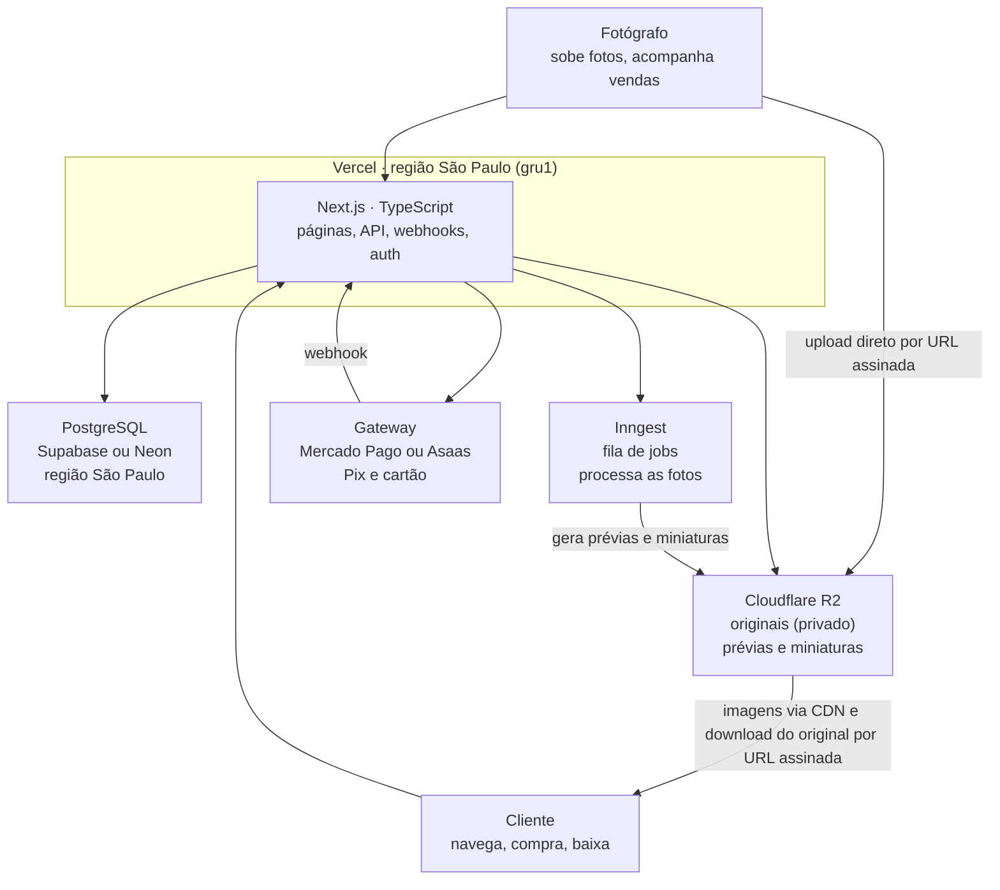

# Arquitetura — Plataforma de Venda de Fotos

Oct 6, 2026 · @gabriel

## Visão geral

Um marketplace onde fotógrafos sobem fotos de eventos e clientes encontram e compram as suas. A plataforma fica com uma comissão por venda e repassa o restante ao fotógrafo.

**Premissas adotadas (confirmar):**

- Foco inicial em fotos de eventos (corridas, festas, formaturas, esportes), vendidas por foto ou por pacote.
- Mercado brasileiro: preços em reais, pagamento por Pix e cartão, dados hospedados no Brasil.
- Fotógrafos podem subir JPG ou RAW (CR2/CR3, NEF, ARW, RAF, DNG).

**Escopo do MVP:**

- Cadastro e login de fotógrafos e clientes
- Fotógrafo cria um evento e sobe fotos em lote
- Geração automática de prévia com marca d'água e miniatura
- Galeria pública por evento, com busca por nome ou data
- Carrinho, checkout com Pix/cartão e download do original após o pagamento
- Painel do fotógrafo com vendas e saldo a receber

**Fora do MVP:** busca por rosto ou número de peito, planos pagos para fotógrafos, app mobile.

## Stack técnica

TypeScript de ponta a ponta, com Next.js no front e no back, PostgreSQL para os dados e Cloudflare R2 para os arquivos.

| Camada | Escolha | Por quê |
|---|---|---|
| Linguagem | TypeScript | Uma linguagem só no front e no back |
| Framework web | Next.js (App Router) | Páginas com SEO, API e webhooks no mesmo projeto |
| Banco de dados | PostgreSQL | Dados relacionais e transações seguras para pedidos e pagamentos |
| Acesso ao banco | Drizzle ORM | Leve, tipado e próximo do SQL |
| Arquivos | Cloudflare R2 | Compatível com S3 e sem custo de transferência de saída |
| Processamento de imagem | Sharp | Sharp gera miniaturas e prévias; LibRaw converte o RAW antes |
| Fila de tarefas | Inngest | Processa uploads em segundo plano sem manter servidor de fila |
| Autenticação | Better Auth | Open source, guarda os usuários no seu próprio Postgres |
| Pagamento | Mercado Pago ou Asaas | Pix, cartão e split para repasse ao fotógrafo |
| Interface | Tailwind CSS + shadcn/ui | Componentes prontos e fáceis de customizar |
| E-mail | Resend | Confirmação de compra e links de download |

## Componentes e deploy

O Next.js na Vercel é o centro: ele fala com o banco, a fila, o storage e o gateway. Os arquivos pesados nunca passam por ele.



O fotógrafo envia as fotos direto ao R2; o cliente recebe prévias pela CDN e o original por um link temporário depois de pagar.

## Armazenamento das fotos

Cada foto vira três arquivos no R2 (quatro, se for RAW), separados em dois buckets: um privado para os originais e um público para o que aparece no site. O banco guarda só as chaves desses arquivos.

| Versão | Bucket | Tamanho aproximado | Uso |
|---|---|---|---|
| Original | `fotos-originais` (privado) | JPG 8 a 15 MB; RAW 25 a 60 MB | Entregue só ao comprador, por URL assinada |
| JPG de entrega (só RAW) | `fotos-originais` (privado) | 10 a 25 MB | Entregue ao comprador no lugar do RAW (ou junto, ver decisão em aberto) |
| Prévia com marca d'água | `fotos-publicas` | 200 a 300 KB, 1600 px | Página da foto e galeria ampliada |
| Miniatura | `fotos-publicas` | 30 a 50 KB, 400 px | Grade da galeria |

**Padrão de nomes das chaves:**

```
originais/{fotografo_id}/{evento_id}/{foto_id}.{extensao_original}
entregas/{fotografo_id}/{evento_id}/{foto_id}.jpg
previas/{fotografo_id}/{evento_id}/{foto_id}.webp
miniaturas/{fotografo_id}/{evento_id}/{foto_id}.webp
```

- Usar o `foto_id` (UUID) como nome evita colisão e não expõe o nome original do arquivo.
- O bucket público fica atrás de um domínio próprio na Cloudflare (ex.: `img.seusite.com.br`), com cache de CDN.
- O original nunca tem URL pública: o download usa uma URL assinada válida por cerca de 15 minutos, gerada só para quem comprou.
- Regra de retenção a decidir: por exemplo, mover originais de eventos com mais de 12 meses para armazenamento mais barato ou apagá-los. Originais de fotos vendidas seguem a regra de acesso do comprador (ver "Acesso às compras").

**Arquivos RAW:**

- O RAW é guardado como veio, no bucket privado. O navegador não exibe RAW, então o job converte o arquivo com LibRaw antes de gerar prévia e miniatura.
- Para entrega, o job também gera um JPG em resolução total a partir do RAW (`entregas/{fotografo_id}/{evento_id}/{foto_id}.jpg`, chave salva em `fotos.chave_entrega`), porque a maioria dos clientes não consegue abrir RAW.
- A conversão automática não aplica a edição do fotógrafo (cor, exposição, corte); o JPG de entrega sai "cru". Vale avisar isso no upload.
- Custo: um RAW ocupa de 3 a 4 vezes o espaço de um JPG, mais o JPG de entrega. Cobrar armazenamento do fotógrafo ou limitar RAW por plano fica mais importante.
- Processar RAW de até 100 MB exige mais memória e tempo; se as funções da Vercel não derem conta, a conversão vai para um worker separado (container em Fly.io ou Railway).
- **Decisão em aberto:** o cliente recebe o RAW, o JPG convertido ou os dois (com preços diferentes)?

## Modelo de dados

Oito tabelas cobrem o MVP. Valores em dinheiro ficam em centavos (inteiro) para evitar erro de arredondamento, e todos os IDs são UUID.

| Tabela | Campos principais | Relaciona com |
|---|---|---|
| `usuarios` | id, nome, email, papel (cliente, fotografo, admin), criado_em | — |
| `fotografos` | id, usuario_id, nome_publico, slug, cpf_cnpj, conta_recebimento_id, comissao_pct | usuarios (1:1) |
| `eventos` | id, fotografo_id, titulo, slug, data, cidade, preco_padrao_centavos, status (rascunho, publicado, arquivado) | fotografos (N:1) |
| `fotos` | id, evento_id, chave_original, chave_entrega (só RAW, opcional), chave_previa, chave_miniatura, largura, altura, tamanho_bytes, preco_centavos, status (processando, pronta, erro), criado_em, excluida_em (opcional) | eventos (N:1) |
| `pedidos` | id, cliente_id (opcional), email_comprador, token_acesso_hash, acesso_expira_em, total_centavos, status (pendente, pago, cancelado, estornado), gateway_id, pago_em | usuarios (N:1, opcional) |
| `itens_pedido` | id, pedido_id, foto_id, preco_centavos, valor_fotografo_centavos, valor_plataforma_centavos | pedidos, fotos |
| `downloads` | id, item_pedido_id, baixado_em, ip | itens_pedido (N:1) |
| `repasses` | id, fotografo_id, valor_centavos, status (previsto, pago), periodo, pago_em | fotografos (N:1) |

- `itens_pedido` grava o preço e a divisão no momento da compra; se o fotógrafo mudar o preço depois, o histórico não muda.
- `pedidos.gateway_id` liga o pedido ao pagamento no Mercado Pago ou Asaas e é a chave usada pelo webhook.
- **Exclusão lógica de fotos:** quando o fotógrafo apaga uma foto, o sistema preenche `fotos.excluida_em` em vez de apagar a linha. A foto some da galeria (todas as consultas públicas filtram `excluida_em IS NULL`), mas quem já comprou continua baixando. O original só é apagado do R2 se a foto não tiver nenhum item em pedido pago.
- **Índices iniciais:**
  - `fotos(evento_id)`
  - `eventos(slug)` — único
  - `pedidos(cliente_id)`
  - `pedidos(gateway_id)` — **único**: o webhook busca o pedido por essa coluna, e a restrição impede dois pedidos com o mesmo pagamento
  - `itens_pedido(foto_id)`

## Fluxos principais

O pagamento só é considerado confirmado pelo webhook do gateway, nunca pelo retorno do navegador.

**Upload (fotógrafo)**

1. O fotógrafo escolhe o evento e seleciona as fotos.
2. O site pede ao servidor uma URL assinada de upload para cada foto e cria o registro em `fotos` com status `processando`.
3. O navegador envia cada arquivo direto ao bucket privado, sem passar pelo servidor.
4. Ao fim de cada envio, o servidor dispara um job no Inngest.
5. O job baixa o original (se for RAW, converte antes com LibRaw e salva o JPG de entrega em `chave_entrega`), gera prévia com marca d'água e miniatura com Sharp, salva no bucket público e marca a foto como `pronta`.

**Galeria (cliente)**

1. O cliente abre a página do evento, renderizada no servidor para ser indexada pelo Google.
2. O banco devolve as fotos prontas e não excluídas, paginadas; as imagens vêm da CDN.

**Compra e pagamento**

1. O cliente adiciona fotos ao carrinho e vai ao checkout.
2. O servidor cria o `pedido` como `pendente` e a cobrança no gateway (Pix ou cartão), com o split já calculado.
3. O gateway chama o webhook ao confirmar o pagamento.
4. O webhook valida a assinatura, busca o pedido por `gateway_id`, marca o pedido como `pago` numa única transação (só se ainda estiver `pendente`) e envia o e-mail com o link da área de downloads.

**Download**

1. Na área "Minhas compras", o cliente clica em baixar.
2. O servidor confere se a foto pertence a um pedido pago daquele cliente, registra em `downloads` e responde com uma URL assinada de 15 minutos para o original (ou para o JPG de entrega, se a foto for RAW). Fotos com `excluida_em` preenchido continuam disponíveis para quem comprou.

**Acesso às compras: cliente logado e convidado**

O arquivo nunca é copiado para a conta de ninguém: o original fica uma vez só no R2, e o que muda é por quanto tempo a pessoa pode gerar links de download.

| | Cliente logado | Convidado (sem login) |
|---|---|---|
| Pedido ligado a | `cliente_id` | `email_comprador` |
| Como acessa | Área "Minhas compras" | Link enviado por e-mail, com token secreto |
| Validade do acesso | Enquanto o original existir (ver retenção) | Prazo fixo, ex.: 7 ou 30 dias (`acesso_expira_em`) |
| Link de download | URL assinada nova a cada clique, 15 min | URL assinada nova a cada clique, 15 min |

- O token do convidado é gerado aleatoriamente; o banco guarda só o hash (`token_acesso_hash`), como uma senha.
- Ao criar conta com o mesmo e-mail, os pedidos de convidado são vinculados automaticamente ao novo `cliente_id`, com o e-mail confirmado antes.
- Depois do download, a página do convidado oferece criar conta para guardar as fotos.
- **Decisão em aberto:** originais vendidos nunca são apagados, ou o acesso do cliente logado também tem prazo (ex.: 2 anos, com aviso por e-mail antes de expirar)?

**Repasse ao fotógrafo**

1. Com split no gateway, a parte do fotógrafo cai direto na conta dele; a tabela `repasses` serve de extrato.
2. Sem split, um job mensal soma as vendas do período e gera os repasses a pagar.

## Segurança, LGPD e backups

O original é o ativo que se vende, então a regra central é: nenhum original fica acessível sem um pedido pago.

- **Acesso aos arquivos:** bucket de originais 100% privado; URLs assinadas curtas para upload e download; chaves do R2 só no servidor.
- **Webhooks:** validar a assinatura de cada chamada do gateway e tratar chamadas repetidas sem duplicar o pedido (índice único em `pedidos.gateway_id` + atualização condicional de `pendente` para `pago`).
- **Upload:** aceitar JPEG e os formatos RAW listados, limitar o tamanho (ex.: 100 MB) e conferir o tipo real do arquivo no job, não só a extensão.
- **Autorização:** fotógrafo só vê e edita os próprios eventos; cliente só baixa o que comprou.
- **LGPD:** banco na região São Paulo, política de privacidade publicada, opção de excluir conta, e coleta mínima de dados (CPF/CNPJ só do fotógrafo, para o repasse). Fotos com pessoas são dado pessoal: prever um canal para pedido de remoção.
- **Backups:** backup diário automático do Postgres com recuperação para um ponto no tempo (incluso nos planos pagos do Supabase e do Neon); originais no R2 com uma cópia em outro provedor (ex.: Backblaze B2) quando o volume justificar.
- **Cartão:** os dados do cartão nunca passam pelo seu servidor; o checkout do gateway cuida disso.

## Estrutura de pastas

Um único projeto Next.js, com as regras de negócio separadas das páginas para facilitar testes e uma futura API para app mobile.

```
src/
  app/
    (publico)/              # home, eventos, página da foto
    (cliente)/              # carrinho, checkout, minhas compras
    (fotografo)/painel/     # eventos, upload, vendas, saldo
    (admin)/                # moderação e suporte
    api/
      upload/               # gera URLs assinadas de upload
      download/[itemId]/    # gera URL assinada do original
      webhooks/pagamento/   # confirmação do gateway
      inngest/              # endpoint dos jobs
  db/
    schema.ts               # tabelas do Drizzle
    migrations/
  servicos/                 # regras de negócio: pedidos, fotos, repasses
  jobs/                     # processar-foto, repasse-mensal
  lib/                      # clientes do R2, gateway, auth, e-mail
  components/               # UI (shadcn/ui)
```

## Riscos e erros possíveis

Os 20 riscos mapeados, com como evitar e prioridade, estão em documento próprio: [Riscos e Erros Possíveis — Plataforma de Venda de Fotos](riscos.md).

## Decisões em aberto e próximos passos

Cinco decisões de produto mudam detalhes da arquitetura e precisam ser fechadas antes de começar o código.

**Decisões em aberto**

- [ ] Tipo de foto: só eventos, ou também banco de imagens (fotos avulsas com licença de uso)?
- [ ] Gateway: Mercado Pago ou Asaas? Com split automático ou repasse manual?
- [ ] Comissão da plataforma: percentual fixo ou por plano do fotógrafo?
- [ ] Retenção: por quanto tempo os originais ficam disponíveis após o evento?
- [ ] Banco gerenciado: Supabase ou Neon?

**Próximos passos**

- [ ] Criar contas: Vercel, Neon ou Supabase (região São Paulo), Cloudflare R2 e o gateway escolhido
- [ ] Iniciar o projeto Next.js com TypeScript, Tailwind e Drizzle
- [ ] Escrever o `schema.ts` e rodar a primeira migração
- [ ] Implementar o fluxo de upload com processamento das imagens
- [ ] Implementar galeria, checkout, webhook e download, nessa ordem
